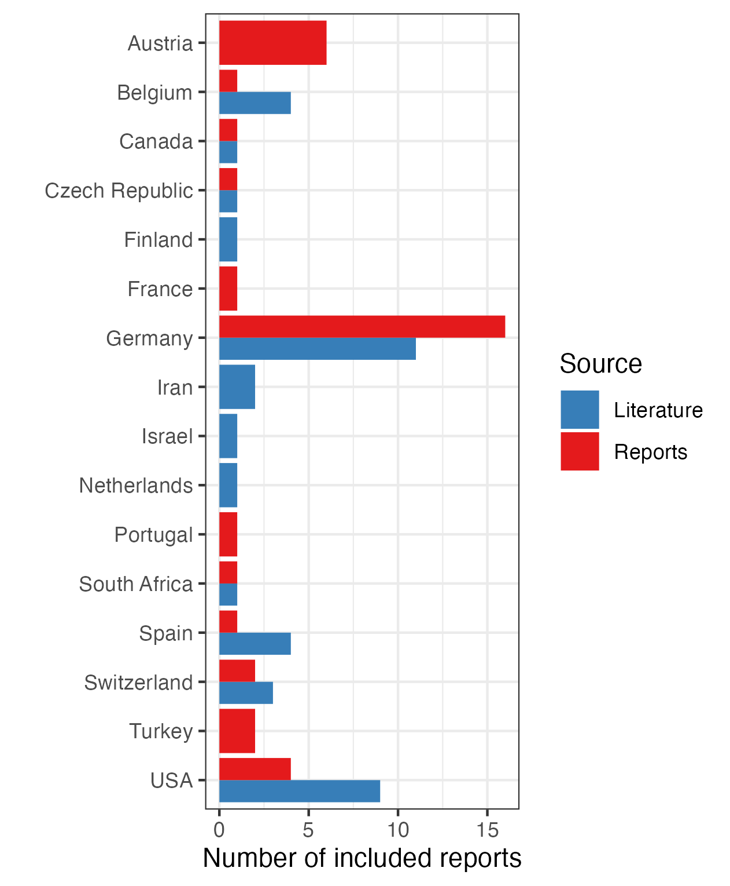
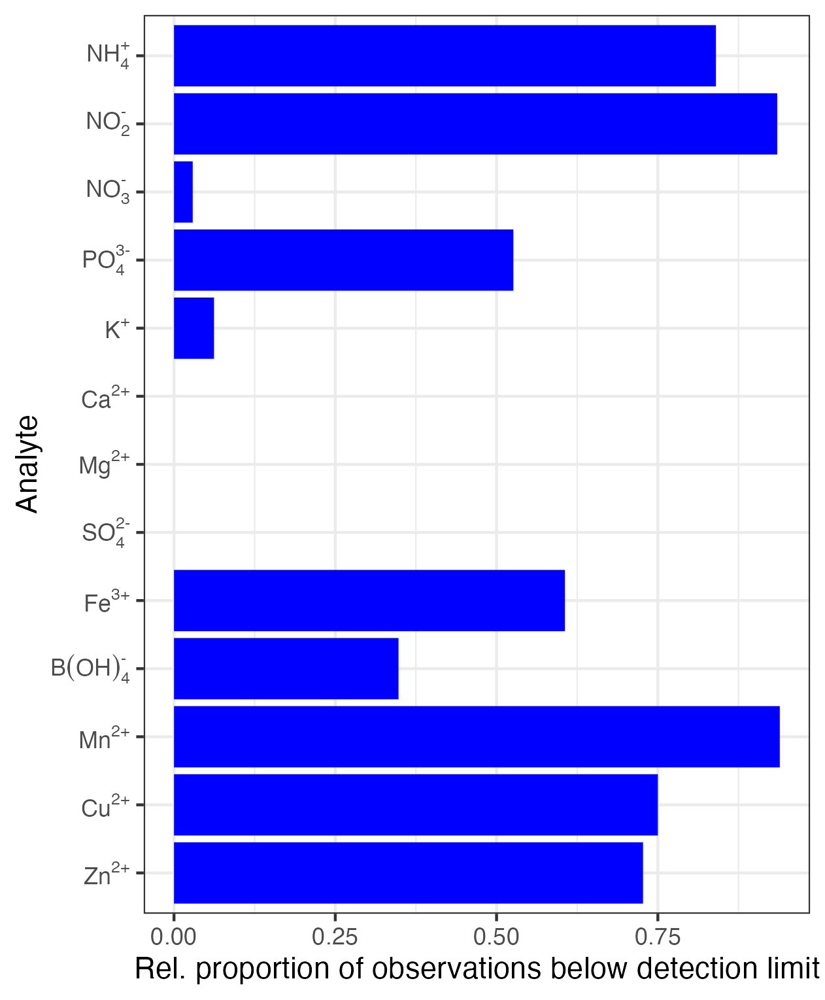
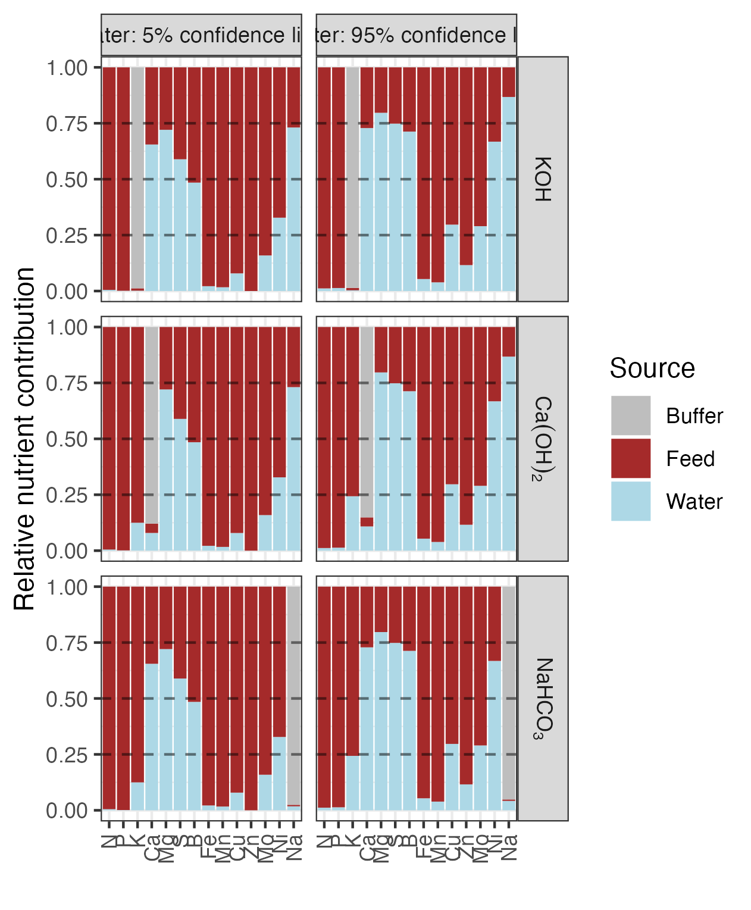
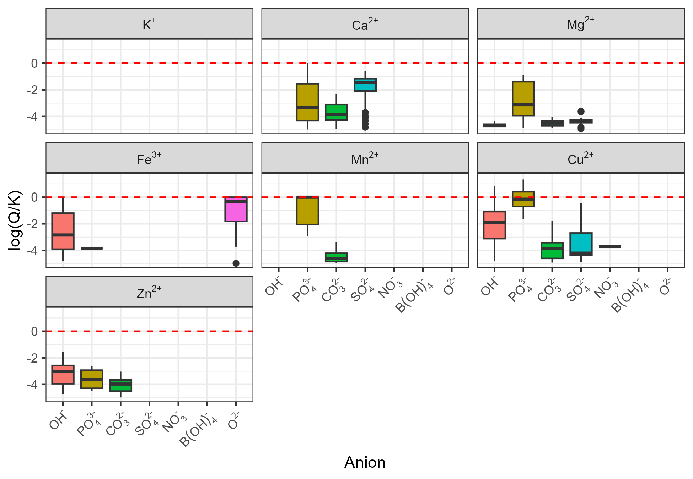

```{r message=FALSE, warning=FALSE, include=FALSE}
# Knitr options
knitr::opts_chunk$set(echo = FALSE)

# Load packages
library(here)
library(XLConnect)
library(readxl)
library(tidyverse)
library(gdata)
library(viridis)
library(RColorBrewer)
library(bookdown)
#library(redoc)
library(png)
```


# Abstract
Developing a dedicated feed for aquaponics was seen as promising "off-the-shelf" solution for nutrient management in aquaponic systems but a formulation that yields comparable results over a broad range of systems needs to take the variability in inputs originating from other nutrient sources into account. Furthermore, prior studies showed that concentrations of some plant nutrients cannot be increased by elevated inclusion rates in the feed. This raises the question whether nutritent imbalances might originate from physico-chemical constraints rather than suboptimal inputs. 
Literature data were collected and amended with water analysis reports to develop nutrient input scenarios representative for the respective studies. The data was eventually used to model precipitation under the given conditions.
It was found that 


When trying to improve system performance via formulation of a tailored aquafeed, reducing inclusion rates of nutrients affected by precipitation (Ca, Fe) appears to be more meaningful than increasing inclusion rates of well-soluble nutrients (K, Mg). These can instead be supplied via alkalinity supplements.


# Introduction
Aquaponics is a hybrid food production system, coupling aquaculture and soilless horticulture (hydroponics). Compared with uncoupled, independent systems, advocates of the aquaponics principle with an aquaculture background claim that added value is created by preventing the release of aquaculture wastes into the environment but converting them into edible yield instead [@Turnsek2020]. Furthermore, it was found that there is no significant difference in the yield of several leafy greens such as lettuce, spinach, basil, dill, coriander, parsley, rook and even fruiting plants such as tomato that can be achieved in aquaponic versus hydroponic systems [@Lennard2019; @Atique2022; @Anderson2017; @Maucieri2019a; @Suhl2016; @Pantanella2012]. This is noteworthy against the background that nutrient deficiencies are frequently reported when comparing the nutrient concentrations in aquaponic systems with those usually targeted in hydroponics [@Lunda2019; @Robaina2019; @Graber2009; @Bittsanszky2016]. As of today, the essentiality of 15 elements that are usually grouped into macro- and micronutrients, according to their abundance in plant tissues, is established for higher plants. Elements classified as macronutrients are carbon (C), hydrogen (H), oxygen (O), nitrogen (N), phosphorus (P), potassium (K), calcium (Ca), magnesium (Mg), and sulfur (S), while the micronutrients comprise iron (Fe), manganese (Mn), copper (Cu), zinc (Zn), molybdenum (Mo), and boron (B) [@Marschner2012]. The essentiality of nickel (Ni) and chloride (Cl) is currently under discussion [@Mengel2001].
A major problem regarding the commercial viability of aquaponic systems arises from the system's complexity, adding extra costs to the budget. Achieving similar yields as hydroponics is thus seen as insufficient to render aquaponics competitive under present circumstances compared to conventional hydroponics [@Quagrainie2017]. Interestingly, aquaponics seems to offer the potential to reach even higher yields than hydroponics if certain nutrients are amended as described for lettuce [@Monsees2019; @Delaide2016], basil [@Rodgers2022] and tomato [@Roosta2013]. This raises the issue of whether it is possible to streamline nutrient inputs in such way that extraordinary manual interventions become obsolete.

## Nutrient sources
Nutrients enter aquaponic systems through the source water, alkalinity supplements used for pH control, and the daily ration of feed for the aquatic livestock, hereinafter denoted as aquafeed [@Eck2019; @Robaina2019; @Rakocy2006]. 

The importance of water as nutrient source is usually seen as negligible [@Schmautz2016]. However, it was found that it can introduce large amounts of some plant nutrients such as Ca, Mg and S [@Delaide2017]. Though, water can vary in its composition, depending on its origin. A glimpse of the extent of variability of terrestrial waters in their chemical composition is provided in Figure \@ref(fig:waterConcFreq). Weathering of rock, ion exchange, redox reactions and the buildup of biomass are the main processes that are affecting concentrations of the shown compounds [@Stumm1981]. The highest variability can be found in anionic compounds such as nitrate ($\text{NO}_{3}^{-}$) and sulfate ($\text{SO}_{4}^{2-}$) and the cationic alkaline earth metals $\text{Ca}^{2+}$ and $\text{Mg}^{2+}$ that are covering a concentration range of approximately two orders of magnitude.

```{r waterConcFreq, fig.cap="Cumulative frequency distribution of chemical compounds in terrestrial waters. X-axis: logarithmic concentration of compounds. 1 ppm = 1 $\text{mg L}^{-1}$. Y-axis: Percentage of sampling points [@Stumm1981].", echo=FALSE}

knitr::include_graphics("images/Stumm_Morgan_Aquatic_Chemistry_p873.png")
```

The term alkalinity supplements summarizes several alkaline substances that are used to maintain a stable pH in the water [@Timmons2010]. Nitrification decreases the pH over time and, consequently, also the activity of nitrifyers [@Ward2011]. Thus, a stable pH has to be maintained to ensure both high nitrification performance and animal welfare. For this purpose, several Na-based substances such as sodium hydrogen carbonate (baking soda, $\text{NaHCO}_{3}$) are commonly used in aquaculture due to their high and rapid solubility at a comparably cheap price. However, high sodium (Na) concentrations must be avoided in aquaponic systems due to its phytotoxicity [@Maathuis2014]. Na is therefore replaced with several other supplements based on K or Ca that come with the benefit of providing an additional source of nutrients besides increasing the pH. 

Aquafeeds are considered to be the most important source of nutrients, providing a large and continuous nutrient input into the system. Formulating a specific aquaponics feed was thus thought to be the most suitable approach to develop an "off-the-shelf" nutrient delivery system [@Lennard2017; @Eck2019]. When discussing aquafeeds as nutrient input route, it is important to consider pathways of diet utilization, as shown in Figure \@ref(fig:pathwaydigestion). Uneaten feed and the indigestible mass fraction of ingested feed make up the solid wastes. The digestible mass fraction is meanwhile utilized to sustain the animals' basal metabolism, somatic growth and reproductive activity. Metabolic end products are then excreted via the gills and the urinary system in form of dissolved matter [@Evans2005; @Hardy2003a]. Only the dissolved fraction of the nutrients is immediately available for plant uptake via the root system.

```{r pathwaydigestion, fig.cap="A simple graphical representation of nutrient flows and excretion patterns in aquatic animals [@Bureau2010].", echo=FALSE}

knitr::include_graphics("images/2010_Bureau.png")
```

The availability of digestibility, retentiton and excretion data for individual nutrients, with the former expressed with apparent digestibility coefficients (ADC), depends on whether the nutrient is essential and has to be considered for feed formulation. 
N that is, for the most part, present as crude protein (CP) in aquafeeds, is generally well-digestible, with ADCs usually being above 70% and on average approximately 90% [@IAFFD2021; @Guillaume2001]. The excretion of N as end product of the protein and amino acid catabolism takes place in form of ammonia ($\text{NH}_{3}$) and, to a small extent, urea. The predominant excretory site are the gills, followed by renal excretion [@Dabrowski2003]. 
A less digestible nutrient is P with ADC ranging from 70% to only 40% and a resulting excretion of 30% to 60% of the supply [@Lall2003; @Sugiura2018]. Especially plant ingredients in aquafeeds can cause low ADC if they are rich in phytic acid. Phytic acid is poorly digestible and can furthermore reduce the digestibility of minerals in the feed. This might also explain contradictory information in literature with reported renal excretion rates of 90% of the total excreta [@Lall2003] in contrast to estimates of 28% of excretion taking place in dissolved form and 30% to 64% excreted as particulate P [@Dabrowski2003].
Studies about ADCs of the remaining plant nutrients are scarce. Variability of ADC among different feed ingredients was shown in Atlantic salmon (*Salmo salar*) for Ca, Mg, Fe, Mn and Zn, with ADCs ranging between 30% to 50% [@Sugiura1998]. Excretion of the earth alkaline metals Ca and Mg primarily occurs in dissolved form via the gills and urine [@Lall2003; @Oikari1985]. Mn, in contrast, is mostly excreted in solid form as feces, while renal excretion was found to be negligible [@Lall2003]. Cu is predominantly excreted via the bile [@Bury2003]. Excess dietary Cu is not taken up but excreted as feces. Cu inclusion rates in aquafeeds are thus reduced to minimize its release into the environment [@Lall2003]. Excretion of Zn mostly takes place renally and via the gills [@Lall2003].
Given the above-stated information, an animal nutritionist's approach to develop a tailor-made aquafeed for aquaponics might follow the paradigm that a target concentration of nutrients, for instance given by commonly used hydroponic nutrient solutions in hydroponics such as Hoaglands solution [@Resh2016] is taken as template. Inclusion rates of the respective nutrients might eventually be back-calculated using nutrient digestibility and retention data. Within this context, it is necessary to ensure those nutrients can be supplied without facing the risk of over- or undersupply. Therefore, it is necessary to have profound knowledge about the variability of nutrient concentrations within their respective nutrient sources. Furthermore, it needs to be considered that physico-chemical constraints might limit the concentration of a substance in solution. Accordingly, previous studies found that the concentrations of some nutrients were not responsive to elevated inclusion rates in aquafeeds. It is thus worth to extend the nutritionist's approach, illuminating the "aquaponic dark room" with respect to the chemical fate and behavior of nutrients.


## Chemical reactions affecting plant nutrient availability
Hydroponics literature highlights that understanding aquatic chemistry is crucial for successful nutrient management [@Sambo2019]. The prerequisite for plant nutrients to be available for plant uptake via the roots is that they must be present in dissolved form. However, the concentration of dissolved substances underlies physico-chemical constrains. In hydroponics, these constraints are well-described as they have to be taken into account when intending to formulate cost-efficient fertilizers [@DeRijck1999b]. 
The most important reactions that are determining the concentration of plant nutrients in water are acid-base, dissolution-precipitation, and complex formation reactions [@Sambo2019]. The following description of these reactions intends to give a brief introduction into their underlying mechanisms and their relevance for nutrient management. Describing these reactions in greater detail is out of scope of this manuscript. Further information can be obtained by consulting dedicated literature [@Jensen2003; @Stumm1981].
If P is introduced into water in form of phosphoric acid (H$_{3}$PO$_{4}$), also called orthophosphoric acid, it undergoes the following acid-base reactions.

\begin{equation}
  \text{H}_{3}\text{PO}_{4} + \text{H}_{2}\text{O} \rightleftarrows \text{H}_{2}\text{PO}_{4}^{-} + \text{H}_{3}\text{O}^{+}
  (\#eq:H3PO4)
\end{equation}

\begin{equation}
  \text{H}_{2}\text{PO}_{4}^{-} + \text{H}_{2}\text{O} \rightleftarrows \text{HPO}_{4}^{2-} + \text{H}_{3}\text{O}^{+}
  (\#eq:H2PO4-)
\end{equation}

\begin{equation}
  \text{HPO}_{4}^{2-} + \text{H}_{2}\text{O} \rightleftarrows \text{PO}_{4}^{3-} + \text{H}_{3}\text{O}^{+}
  (\#eq:HPO42-)
\end{equation}

Based on the reaction equations \@ref(eq:H3PO4), \@ref(eq:H2PO4-) and \@ref(eq:HPO42-) it can be grasped that P is now present in four forms of orthophosphates, the so-called species, that differ in their degree of protonation and their chemical behavior. The extent to which the described dissociation reactions (the removal of H$^{+}$) occur depends on the pH of the system and can be mathematically described by a characteristic acid equilibrium constant $K_{a}$ for each reaction step [@Jensen2003]. 
If a counterion that forms precipitates with an orthophosphate species is introduced into the system in an amount that is exceeding a specific saturation concentration, a precipitate might be formed. This could be avoided by complex formation reactions where a chelating agent, forms a complex molecule which is "hidden" and thus excluded from precipitation. Complex molecules are formed especially with cations of transition metal and they can lead to concentrations of these metals that are exceeding their saturation concentrations by three to four orders of magnitude [@Jensen2003].


## Differences between hydroponic and aquaponic systems
An understanding of the effects and constraints that are resulting from the described reactions is crucial for successful nutrient management in both hydroponic and aquaponic systems to ensure that nutrients that are introduced into the system are in fact present in a plant-available form. With respect to typical hydroponic conditions, these effects were exhaustively described [@DeRijck1997; @DeRijck1998; @DeRijck1998a; @DeRijck1999b]. However, no such work has been conducted for aquaponics.
Overall, the two main differences described between hydroponic and aquaponic systems are 1) the pH and 2) the concentration of dissolved organic matter (DOM). 
The pH, as described before, determines the speciation of nutrients and thus their mobility and plant availability. In hydroponic systems, maintaining a pH between 5.8 and 6.4 is recommended to provide optimum conditions for the plants, depending on the species to be cultivated [@Resh2016]. Nitrifying bacteria, on the other hand, show best activity at a pH above 7.0 [@Ward2011]. The first permanently coupled aquaponic systems that consisted of a closed loop where water would permanently circulate between the aquaculture and hydroponics unit. As a trade-off between optimum conditions for plants and nitrifyers, the pH in these systems was recommended to be maintained close to 7.0 [@Rakocy2006]. The desire to overcome the limitation that the performance of at least one of the two units of a permanently coupled aquaponic system would be compromised led to the development of on-demand coupled aquaponic systems with two independent loops. Here, a unidirectional connection between a recirculation aquaculture system (RAS) and a separate hydroponic system allows to maintain different pH in both units. The aquaculture water can eventually be fed into a fertilizer reservoir and allows for further addition of nutrients, pH adjustment and alike [@Kloas2015]. However, when examining the fate and behavior of nutrients in aquaponics from a chemical point of view, the conditions at the input site matter.
DOM is a collective term for a multitude of not closer defined disolved carbon-based molecules originating from decay of organic matter in water. DOM can be divided into humic and non-humic substances, with the former consisting of humin, humic and fulvic acids and the latter being a potpourri of amino acids, (poly-)peptides, carbohydrates and other organic substances [@Boyd2019]. DOM has several beneficial effects on plants. as the mobilisation of microminerals via complexation [@Schnitzer1969; @Chen2004a]. Furthermore, DOM was found to potentially act as biostimulant for plant growth [@Canellas2015]. However, DOM is usually not present in large quantities in hydroponic systems, but instead tried to be removed. DOM serves as C source for heterotrophic bacteria, thus enhancing their growth and causing a depletion of oxygen in the rhizosphere. Furthermore, strong growth comes with the formation of biofilms that can potentially clog small and thin components such as vents, tubes and jets of irrigation systems [@Raviv2007]. Using the total organic carbon (TOC) concentration as sum parameter for the determination of DOM, $20 \text{ mg L}^{-1}$ TOC were reported in wastewater from hydroponic greenhouses [@Prystay2001]. The DOM in hydroponics likely originates from root exudates of the plants that are excreted in order to take up other nutrients [@Mengel2001]. In RAS, TOC concentrations are originating from the steady input of aquafeeds [@Dalsgaard2011]. In a study with pikeperch (*Sander lucioperca*) reared in RAS at a stocking density of $15 \text{ kg m}^{-3}$ under different accumulating feed burdens, TOC concentrations ranging from $20.4 \text{ mg L}^{-1}$ to $47.0 \text{ mg L}^{-1}$ were found [@Steinberg2018].


## Objectives
This study reviews aquaponics studies in an attempt to exemplary identify the average contribution of different nutrient sources and their variability with respect to the total daily nutrient inputs. Furthermore, given the stated differences between hydroponic and aquaponic systems, it is intended to determine saturation levels of plant nutrients under standard aquaponic conditions. Recommendations with regards to the potential formulation of tailored aquafeeds and nutrient management in aquaponics shall eventually be developed to enhance the overall performance and profitability of aquaponic systems.


# Methodology

```{r Source scripts, message=FALSE, warning=FALSE, include=FALSE}
# Data import
source('R/data_import.R') # Currently using gdata

# Data wrangling
source("R/wrangling_dom.R")
source("R/wrangling_precipitation.R")
source("R/wrangling_logQK.R")

# Plots
source("R/plot_dom.R")
source("R/plot_logQK.R")
source("R/plot_precipitation2.R")
```


## Software
All calculations were conducted using Visual MINTEQ (v3.1) and its default database and R (v4.2.2) with RStudio ("Spotted Wakerobin" Release) as graphical user interface.


## Data acquisition and wrangling
The data acquisition and processing steps are graphically summarised in Figure \@ref(fig:dataAnalysisWorkflow). Literature was screened for studies that focussed on nutrient dynamics in aquaponic systems, resulting in an initial dataset (IDS) of 117 individual observations originating from 39 publications. Selected literature comprised studies about permanently and on-demand coupled freshwater aquaponics, sludge remineralisation studies and hydroponic growth trials with water originating from aquaculture systems. The cultivated species, location of the experimental site, pH, volume of the system parts, daily water exchange rate, initial and final bodyweight, stocking density, daily feeding rate, feed name, and the concentrations of all essential plant nutrients in the source water, feed, and system water were collected.


```{r dataAnalysisWorkflow, fig.cap="Graphical representation of the data acquition and wrangling steps. IDS: Initial dataset; FDS1 and 2: Filtered datasets; SWDS: Source water dataset; FIDS: Feed information dataset; ASDS: Alkalinity supplements dataset; Green box: filter applied; red box: external data added; solid line: dataset; dotted line: data derived from initial dataset; dashed line: data derived from external source; thick solid line: final usage of data.", echo=FALSE}


```


## Origin of nutrients
To calculate the proportion contribution of the source water, feed and alkalinity supplements to the total daily nutrient input in the reviewed studies, their average daily inputs per volume unit had to be calculated. For this purpose, statistics describing the average experimental system, system parameters and nutrient inputs were derived from the IDS and merged with external data sources in a four-stage process.

```{r Contribution: Number of publications, message=FALSE, warning=FALSE, include=FALSE}
report_pubs_obs <- read_csv(here("results", "contribution_rearing_data.csv")) %>% 
  summarise(
    observations = n(),
    publications = length(unique(Reference_ID))
  )

read_csv(here("results", "contribution_rearing_data.csv")) %>% 
  summarise(
    unique(Reference_ID)
  )
```
The first step comprised the generation of system assumptions. For this purpose, a filter was applied to the IDS, only including studies that made use of an aquaculture unit, reported the total system volume and the final bodyweight of the livestock at the end of the experiment. The resulting filtered dataset (FDS1) held `r report_pubs_obs$observations` observations originating from `r report_pubs_obs$publications` publications. 
FDS1 was used to calculate the average system volume ($\text{V}_{tot}$; $\text{m}^{3}$), average bodyweight (ABW; g), average number of livestock (AN), average livestock density (AD; kg $\text{m}^{-3}$), and average water exchange rate (AWE; $\text{m}^{3}\text{ d}^{-1}$). ABW was defined as the mean bodyweight during the duration of experiment and was calculated as the arithmetic mean of the initial and final bodyweight. For the calculation of AD, AN and AWE, *NA* values were removed. 
Eventually, the average biomass (ABM; kg) was computed by multiplication of ABW with AN and unit conversion or, if only AD was given, by multiplication of AD with $\text{V}_{tot}$. Vice versa, in case AD was not reported, it was calculated by dividing ABM by $\text{V}_{tot}$. The average daily water exchange volume by multiplication of $\text{V}_{tot}$ with AWE.

```{r Water: Number of publications and reports, include=FALSE}
report_water_total <- read_csv(here::here("results", "contribution_water_countries.csv")) %>% 
  group_by(Source) %>% 
  summarise(n = n()) %>% 
  group_by(Source) %>% 
  summarise(n = n()) %>% 
  pivot_wider(names_from = Source, values_from = n)

report_water_total

report_water_studies_total <- read_csv(here::here("results", "contribution_water_countries.csv")) %>% 
  group_by(Source) %>% 
  summarise(n = n()) %>% 
  pivot_wider(names_from = Source, values_from = n)

report_water_studies_total
```

The second step was estimating the daily nutrient input via source water. For this purpose, gathered location information in the FDS was used to search for water analysis reports provided by the closest water treatment plant. Only official reports provided by local authorities and water utilities in the corresponding municipalities were used to ensure that analyses were conducted according to internationally accepted laboratory standards. Both literature data and collected water analysis reports originated from a total of `r report_water_total$Literature` countries, with `r report_water_studies_total$Literature` literature studies and `r report_water_studies_total$Reports` analysis reports. The country distribution of the literature data compared with gathered water analysis reports is shown in Figure \@ref(fig:waterCountries). It was not possible to obtain water analysis reports from Finland, Iran, Israel and The Netherlands. Thus, reports from Austria, France, Portugal and Turkey were included instead. 

```{r waterCountries, fig.cap=paste0("Number of studies per country in comparison with the number of water analysis reports per country included in the source water dataset. Literature: n = ", report_water_studies_total$Literature, "; reports: ", report_water_studies_total$Reports, "."), echo=FALSE}


```

In water analysis, it is common practice to report the value of the detection limit instead of the measured value in case that the analyte concentration found was below the sensitivity of the instrument used for measurement [@DIN32645]. Figure \@ref(fig:waterAnalysesPerCountry) shows the proportion of data for all considered analytes in the water analysis reports that were found to be below the detection limit. Retaining the detection limits in the dataset leads to mean concentration estimates that are too high. Therefore, concentration data was recalculated using the *cenmle()* function from the R package *NADA* by maximum likelihood estimation (MLE) [@Helsel2011]. This ensured that the estimates for nutrient concentrations in tap water were reliable. The output was eventually used to calculate the two-sided 90% confidence interval for the arithmetic mean of the concentration of each nutrient to describe the concentration range that will be found in 90% of all cases where tap water is used. 
Finally, multiplying the obtained concentrations with AWE yielded the upper and lower limits of the 90% confidence interval of total daily individual plant nutrient inputs via source water.

```{r waterAnalysesPerCountry, fig.cap=paste0("Proportion of water analysis observations per analyte reported to be below detection limit (n = ", report_water_studies_total$Reports, ")."), echo=FALSE, message=FALSE, warning=FALSE}


```

In the third step, daily nutrient inputs via aquafeeds were estimated. The IDS was filtered for studies reporting the name of the commercial aquafeed used (if not selfmade), the CP inclusion rate and the feeding rate. From the resulting FDS2, the average feeding rate ($\text{FR}$; %), CP inclusion rate (ACP) and the averages of all plant nutrients were calculated. Due to lacking nutrient composition data, supplier datasheets were used and amended by literature data in case of utilization of commercial aquafeeds. Incomplete observations with respect to experimental feeds were handled in the same way, merging data from multiple publications if the same feed was used. *NA* values were removed for the computation of averages.
Eventually, the average daily feed input ($\text{FI}$; kg $\text{d}^{-1}$) was calculated by multiplying ABM from the generated system assumptions with \text{FR}. By multiplying $\text{FI}$ with the average plant nutrient inclusion rates in the aquafeeds, the uncorrected total daily input of individual plant nutrients via aquafeeds could be calculated. Obtained values were then corrected by multiplication with apparent digestibility coefficients (ADC), accounting for the digestibility of aquafeeds by fish. An ADC of 90% was assumed for N whereas the ADC of all other nutrients was assumed to be 50% (Lall Fish Nutrition The Minerals, 2002). Finally, it was assumed that 50% of the digestible fraction is retained while the remaining 50% is excreted in dissolved form [@Halver2003]. The indigestible part of the feed is excreted as solid feces and was thus assumed not to participate in chemical reactions in solution.
Lastly, an estimate for the daily input of alkalinity supplements was derived from $\text{AFI}$. First, the daily CP input was calculated by multiplying $\text{AFI}$ with the percentage of $\text{CP}$ on dry matter basis in the feed.

\begin{equation}
  m_{\text{CP}} = \text{FI} \cdot \text{CP}
  (\#eq:mCP)
\end{equation}

Eventually, digestibility and retention were considered and $\text{CP}$ converted into the mass of non-retained N by division through the Kjeldahl factor $f_{K} = 6.25$.

\begin{equation}
  m(\text{N}) = \frac{m_{\text{CP}} \cdot \text{ADC} - r \cdot m_{\text{CP}} \cdot \text{ADC}}{f_{K}}
  (\#eq:mN)
\end{equation}

The activity of nitrifying bacteria in the biofilter follows the overall simplified reaction equation \@ref(eq:nitrification) [@Timmons2010].

\begin{equation}
  \text{NH}_{4}^{+} + 2 \text{ O}_{2} \rightarrow \text{NO}_{3}^{-} + 2 \text{ H}^{+} + \text{ H}_{2}\text{O}
  (\#eq:nitrification)
\end{equation}

Per mole of ammonium ($\text{NH}_{4}^{+}$) that is converted to nitrate ($\text{NO}_{3}^{-}$), two moles of protons (H$^{+}$) are released. Furthermore, it can be derived from equation \@ref(eq:nitrification) that $n(\text{NH}_{4}^{+}) = n(N)$ and $2n(N) = n(\text{H}^{+})$. Thus, the amount of moles that have to be neutralized based on $\text{AFI}$ can be calculated as 

\begin{equation}
  n(\text{H}^{+}) = 2 \cdot \frac{m(\text{N})}{M(\text{N})}
  (\#eq:moles)
\end{equation}

with the molar mass $M(\text{N}) = 14.007 \text{ g mol}^{-1}$. The chemical reaction with bases such as $\text{NaHCO}_{3}$, $\text{KOH}$ or $\text{Ca(OH)}_{2}$ is eventually a simple neutralization reaction of the pattern

\begin{equation}
  \text{H}^{+} + \text{OH}^{-} \rightarrow \text{H}_{2}\text{O}
  (\#eq:neutralisaiton)
\end{equation}

The mass of Na, K or Ca can consequently be calculated by rearranging equation \@ref(eq:moles) and using the correct stoichiometric conversion factor. The daily cost per compound was finally computed by multiplication of the necessary inputs of alkalinity supplement with market prices gathered from www.alibaba.com.


## Fate and behavior of nutrients

### Assumptions and data selection

```{r include=FALSE}
references <- data.frame(refs = list.files("data"))

report_fate_pubs <- references %>% 
  separate(refs, into = c("author", "treatment"), sep = "(?<=[[:digit:]]{4})") %>% 
  summarise(author = unique(author)) %>% 
  filter(author != "contribution" & author != "solubility" & author != "excluded") %>% 
  summarise(authors = n())
```

The IDS was filtered for studies that were reporting the pH of the rearing water, did not conduct a plant growth trial and maintained aerobic conditions. The resulting FDS comprised 25 observations originating from `r report_fate_pubs$authors` publications.
Due to aerobic conditions, metals were assumed to be present in their reduced forms, for instance [Fe$^{3+}$] >> [Fe$^{2+}$], with values in brackets denoting for molar concentrations. The systems in all observations were considered open systems, resulting in dissolved CO$_{2}$ being in equilibrium with atmospheric CO$_{2}$ at a partial pressure of $p_{\text{CO}_{2}} = 0.054 \text{ atm}$. According to Henry's Law, this would result in a concentration of [CO$_{2}$(aq)]$_{total} = K_{H} \cdot p_{\text{CO}_{2}} = 0.018$ mol L$^{-1}$, using the Henry constant of $K_{H} = 3.4 \cdot 10^{-2} \text{ mol L}^{-1} \text{ atm}^{-1}$ [@Stumm1981].


### Complexation, mineral saturation and precipitation
The complexation of plant nutrients by dissolved organic matter (DOM) was simulated using a Gaussian DOM model [@Grimm1991]. It was assumed that DOM is present in the systems at a concentration of 20 mg L$^{-1}$. The charge of the DOM species was calculated according to database values.
To assess whether the waters in the selected literature were saturated with regards to specific minerals, mineral saturation indices were used The saturation index of a mineral is the ratio between its ion product $Q$ and its solubility product $K_{sp}$. $Q$ can be generally expressed as follows 

\begin{equation}
  Q = [\text{cation}(aq)]^m \cdot [\text{anion}(aq)]^n
  (\#eq:Q)
\end{equation}

with expressions in square brackets denoting for empirically found concentrations of the cationic and anionic components of a mineral taken to the power of their stoichiometric coefficients $m$ and $n$. $K_{sp}$ is calculated similarly, as shown in equation \@ref(eq:Ksp)

\begin{equation}
  K_{sp} = [\text{cation}_{sat}]^{m} \cdot [\text{anion}_{sat}]^{n}
  (\#eq:Ksp)
\end{equation}

The empirical concentrations are resembling the saturation concentration for the respective salt and derived from thermodynamic data in case of poorly soluble salts. The mineral saturation index is eventually computed as shown in equation \@ref(eq:logQK).

\begin{equation}
  \text{SI} = \log(\frac{Q}{K})
  (\#eq:logQK)
\end{equation}

A $\text{SI} < 0$ describes a state where the solution is not saturated. Thus, further dissolution of the respective compound is possible. If $\text{SI} = 0$ for a mineral, it can be assumed that the respective mineral controls the solubilty of its constituents, forming a precipitate in case of further addition of one of the constituents. The case $\text{SI} > 0$ is denoting for the solubility being elevated above normal levels. This might be a hint for incorrect model parameters [@Stumm1981].
Given $K_{sp}$, $[\text{cation}]_{init}$ and $[\text{anion}]_{init}$, it is possible to calculate the quantity of the corresponding nutrients that precipitated by rearranging equation \@ref(eq:Ksp), yielding equation \@ref(eq:S).

\begin{equation}
  	S = \sqrt[m+n]{\frac{K_{sp}}{m^{m} \cdot n^{n}}}
  (\#eq:S)
\end{equation}


# Results

## Data
Literature was screened for aquaponic studies to create an initial dataset for further analyses.

```{r include=FALSE}
report_fish_species <- read_csv(here::here("results", "contribution_species.csv")) %>% 
  group_by(group, fish_species) %>% 
  summarise(n = n())

report_fish_groups <- report_fish_species %>% 
  group_by(group) %>% 
  summarise(n = n()) %>% 
  mutate(sum_n = sum(n)) %>% 
  group_by(group) %>% 
  summarise(
    n = n,
    sum_n = sum_n,
    perc = round(n/sum_n * 100, digits = 0)
    ) %>% 
  pivot_wider(names_from = group, values_from = n:perc)
  
report_fish_groups
```

As shown in Figure \@ref(fig:speciesPlot), literature data comprised a total of `r nrow(report_fish_species)` different cultivated fish species, of which `r report_fish_groups$n_Cyprinids` were cyprinids, `r report_fish_groups$n_Percids` percids, `r report_fish_groups$n_Silurids` silurid and `r report_fish_groups$n_Salmonids` salmonid species. Percid fishes were cultivated in `r report_fish_groups$perc_Percids`% and Silurids in `r report_fish_groups$perc_Silurids`% of the studies, while Cyprinids were used in `r report_fish_groups$perc_Cyprinids`% and Salmonids in only `r report_fish_groups$perc_Salmonids`% of the studies.

```{r speciesPlot, fig.cap="Overview of species reared during aquaponic experiments", echo=FALSE}

knitr::include_graphics("plots/species.png")
```


## Origin of nutrients

### Derived rearing assumptions
Assumptions were derived from literature studies about aquaponics to calculate average contributions of different nutrient sources, namely the source water, aquafeeds and alkalinity supplements to total daily nutrient inputs into the system.

```{r include=FALSE}
report_assumptions_rearing <- read_csv(here::here("results", "contribution_assumptions_summary2.csv")) %>% 
  pivot_wider(names_from = "name", values_from = "value") %>% 
  mutate(
    water_per_feed_m3_kg = meanFeed_kg_d / meanFreshwater_m3_d
  )
  
report_assumptions_rearing
```

Analysis of the data presented in the reviewed aquaponics studies revealed that the average total water volume of the aquaculture systems was `r report_assumptions_rearing$meanTotalV` $\text{m}^{3}$ with an average volume of the rearing compartment of `r report_assumptions_rearing$meanRearingV_m3` $\text{m}^3$. An average bodyweight, calculated as the average of the initial and final bodyweight, of `r report_assumptions_rearing$meanABW_g` $\text{g}$ and an average biomass of `r report_assumptions_rearing$meanABM_kg` $\text{kg}$ were found, resulting in an average stocking density of `r report_assumptions_rearing$meanAD_kg_m3` $\text{kg m}^{-3}$. 
The average feeding rate was `r report_assumptions_rearing$meanFR * 100`%, which yielded a daily feed input of `r report_assumptions_rearing$meanFeed_kg_d` $\text{kg d}^{-1}$ with an average CP content of `r report_assumptions_rearing$meanCP`% on dry matter basis. This gives a daily N input of `r report_assumptions_rearing$meanFeed_kg_d * report_assumptions_rearing$meanCP / 6.25*1e3` $\text{g d}^{-1}$.
Based on the average water exchange rate of `r report_assumptions_rearing$meanExchRate * 100`%, a daily freshwater input of `r report_assumptions_rearing$meanFreshwater_m3_d` $\text{m}^{3}\text{ d}^{-1}$ was computed.


### Water, feed, and alkalinity supplements
The average nutrient composition of both aquafeeds and source water and the lower and upper limits of the 90% confidence interval for source water are shown in Table \@ref(tab:nutrientComposition). Figure \@ref(fig:contributionPlot) provides an additional graphical presentation of the findings with emphasis on the variability of nutrient contributions by source water.

```{r, echo=FALSE, message=FALSE, warning=FALSE}
table <- read_csv("results/contribution_plotdata_retention.csv") %>% 
  pivot_wider(names_from = c(Contribution, water), values_from = Total) %>% 
  group_by(nutrient) %>% 
  summarise(
    `Aquafeed $\\bar{x}$ $(\\text{mg d}^{-1})$` = max(`Feed_paste("Water: 5% confidence limit")`),
    `Water 5% $(\\text{mg d}^{-1})$` = max(`Water_paste("Water: 5% confidence limit")`),
    `Water 95% $(\\text{mg d}^{-1})$` = max(`Water_paste("Water: 95% confidence limit")`),
    `Alkal. suppl. $\\bar{x}$ $(\\text{mg d}^{-1})$` = max(`Buffer_paste("Water: 5% confidence limit")`)
  ) %>% 
  mutate(
    `Water $\\bar{x}$ $(\\text{mg d}^{-1})$` = (`Water 5% $(\\text{mg d}^{-1})$` + `Water 95% $(\\text{mg d}^{-1})$`) / 2,
    .before = `Water 95% $(\\text{mg d}^{-1})$`) %>% 
  mutate(
    across(.cols = `Aquafeed $\\bar{x}$ $(\\text{mg d}^{-1})$`:`Alkal. suppl. $\\bar{x}$ $(\\text{mg d}^{-1})$`, .fns= ~round(.*1000, digits = 2))
  ) %>% 
  rename(Nutrient=nutrient)

#table$Nutrient <- fct_relevel(table$Nutrient, c("N", "P", "K", "Ca", "Mg", "S", "B", "Fe", "Mn", "Cu", "Zn", "Mo", "Ni", "Na")

knitr::kable(table, escape = FALSE, caption = paste0("Compositions of nutrient sources and daily inputs. Shown are the averages for both aquafeeds and source water and the lower and upper limits of the \\text interval for the source water. Source water: n = ", report_water_studies_total$Reports, "; Aquafeeds: n = 9"), label = "nutrientComposition")
```


```{r, include=FALSE}
colnames(table) <- c("nut", "feed", "wat5", "wat", "wat95", "alk")

temp <- table %>% 
  mutate(
    sum5 = rowSums(.[c(2,3,6)]),
    sum = rowSums(.[c(2,4,6)]),
    sum95 = rowSums(.[c(2,5,6)]),
    across(.cols = c(2,3,6), .fns = ~round(./sum5*100, digits = 1), .names = "perc5_{.col}"),
    across(.cols = c(2,4,6), .fns = ~round(./sum*100, digits = 1), .names = "perc_{.col}"),
    across(.cols = c(2,5,6), .fns = ~round(./sum95*100, digits = 1), .names = "perc95_{.col}")
  )

temp <- temp %>% 
  arrange(desc(perc_alk)) %>%
  #select(nut | starts_with("perc5") | starts_with("perc95")) %>% 
  #print() %>% 
  pivot_wider(names_from = nut, values_from = feed:perc95_alk)
```


The highest daily nutrient inputs with respect to the macronutrients N and P in the reviewed studies likely originated from aquafeeds, being on average `r temp$perc_feed_N`% and `r temp$perc_feed_P`%, respectively. The overall amounts of these two nutrients contributed by source water are negligible.
Aquafeeds can also be assumed being the main source of the micronutrients Fe, Mn, Cu, Zn, and Mo, with an average contribution of `r temp$perc_feed_Fe`%, `r temp$perc_feed_Mn`%, `r temp$perc_feed_Cu`%, `r temp$perc_feed_Zn`% and `r temp$perc_feed_Mo`%, respectively.
Among these nutrients, Cu and Mo showed the highest variability with respect to the contribution of source water between locations (Cu 90% CI: `r temp$perc5_wat5_Cu`%, `r temp$perc95_wat95_Cu`%; Mo 90% CI: `r temp$perc5_wat5_Mo`%, `r temp$perc95_wat95_Mo`%), with up to amost a third of the daily inputs possibly entering the system via the water. 
Meanwhile, source water likely had a comparably high contribution to Mg and S. With `r temp$perc_wat_Mg`% for Mg (90% CI: `r temp$perc5_wat5_Mg`%, `r temp$perc95_wat95_Mg`%) and `r temp$perc_wat_S`% for S (90% CI: `r temp$perc5_wat5_S`%, `r temp$perc95_wat95_S`%), an average delivery of more than half of the daily input was found. Also, a considerable contribution to daily B (`r temp$perc_wat_B`%; 90% CI: `r temp$perc5_wat5_B`%, `r temp$perc5_wat5_B`%) and Ni (`r temp$perc_wat_Ni`%; 90% CI: `r temp$perc5_wat5_Ni`%, `r temp$perc95_wat95_Ni`%) inputs probably originated from the source water.

```{r contributionPlot, fig.cap=paste0("Relative contribution of source water, feed and alkalinity supplements to total daily nutrient inputs in aquaculture and aquaponic systems. Shown are scenarios reflecting the lower and upper limit of the 90% confidence interval of concentration data from source water. Data derived from water analysis (n = ", report_water_studies_total$Reports, ") and commercial feed analysis reports (n = 9), taking digestibility and retention of feed nutrients into account by assuming 90% apparent digestibility of N, 50% apparent digestibility of all other plant nutrients, 50% retention of the digestible mass fraction by livestock and 100% purity of alkalinity supplements."), echo=FALSE}


```

Inputs of the remaining two nutrients, K and Ca, were found to be heavily depending on the alkalinity supplement used. In absence of the alkalinity supplement, aquafeeds were found to have the greatest impact on K with a contribution of `r temp$feed_K / (temp$feed_K + temp$wat_K) * 100`%, while a higher proportion of Ca (`r temp$wat_Ca / (temp$feed_Ca + temp$wat_Ca) * 100`%; 90% CI: `r temp$wat5_Ca / (temp$feed_Ca + temp$wat5_Ca) * 100`%, `r temp$wat95_Ca / (temp$feed_Ca + temp$wat95_Ca) * 100`%) would enter the system on average via the water, compared with an average of`r temp$feed_Ca / (temp$feed_Ca + temp$wat_Ca) * 100`% of feed contribution. The difference is more pronounced with respect to Na: `r temp$wat_Na / (temp$feed_Na + temp$wat_Na) * 100`% (90% CI: `r temp$wat5_Na / (temp$feed_Na + temp$wat5_Na) * 100`%, `r temp$wat95_Na / (temp$feed_Na + temp$wat95_Na) * 100`%) of the total input was calculated to originate from water while only `r temp$feed_Na / (temp$feed_Na + temp$wat_Na) * 100`% were found to enter the system via daily feeding. 
However, the calculated quantities of alkalinity supplements necessary to maintain a constant pH were found to dominate each input scenario, resulting in a contribution of more than 80% of the total input of K, Ca, or Na in any case. Table \@ref(tab:alkalinitySuppl) summarizes some supplements, their properties and prices. Using one of these substances would result in the supplement contributing `r temp$perc_alk_K`%, `r temp$perc_alk_Ca`% or `r temp$perc_alk_Na`% of the total K, Ca or Na input, respectively.
Regarding the costs for alkalinity supplements, Na based substances are the cheapest, with prices of between 0.01 and 0.03 EUR d$^{-1}$, followed by Ca based supplements ranging in the same price class. The most expensive supplements to be used are those based on K. These substances would cause costs between 0.10 and 0.14 EUR d$^{-1}$, thus being on average `r mean(c(0.1,0.14)) / mean(c(0.01, 0.03))` times more expensive than Ca or Na based substances.


```{r alkalinitySuppl, echo=FALSE, message=FALSE, warning=FALSE}

table <- read_excel(here::here("tables", "alkalinitySupplements.xlsx"))

table <- read_csv(here("results", "contribution_plotdata_retention.csv")) %>% 
  filter(Contribution == "Buffer" & nutrient %in% c("Ca", "K", "Na") & Total != 0) %>% 
  select(-c(water, buffer, Contribution)) %>% 
  group_by(nutrient) %>% 
  summarise(Total = unique(Total)) %>% 
  right_join(table) %>% 
  mutate(
    totalcorr = Total/convfac,
    `Daily cost` = paste0("$", round(price2 * totalcorr*1e-3, digits = 2), "\\text{ EUR d}^{-1}$")
  ) %>% 
  select(-c(nutrient, Total, price2, convfac, totalcorr))


knitr::kable(table, escape = FALSE, caption = "Properties and prices of some Na based alkalinity supplements used in aquaculture and their K and Ca based alternatives for aquaponics (adapted from Bisogni and Timmons, 1994). Prices from https://www.alibaba.com (accessed January 14th, 2023). All chemicals food grade and with a minimum order quantity of one kilogram. Reported is the cheapest sales price.", label = "alkalinitySuppl", digits = 2)
```


## Fate and behavior of nutrients
The proportion of potential cation complexation by DOM was calculated to assess the possible impact of DOM on the solubility of plant nutrients in the reviewed studies. The results are shown in Figure \@ref(fig:species).

```{r include=FALSE}
report_dom <- read_csv(here::here("results", "dom.csv")) %>% 
  group_by(species_name) %>% 
  summarise(
    min = min(percentage_of_total_conc),
    median = median(percentage_of_total_conc),
    mean = mean(percentage_of_total_conc),
    sd = sd(percentage_of_total_conc),
    max = max(percentage_of_total_conc)
  ) %>% 
  mutate(
    species_name = str_remove(species_name, " DOM1"),
    across(.cols = min:max, .fns = ~ round(., digits = 1))
    ) %>% 
  print() %>% 
  pivot_wider(names_from = species_name, values_from = min:max)
```

Under the given assumption of a TOC concentration of $20 \text{ mg L}^{-1}$, representing DOM, and the use of a Gaussian DOM model, five cationic nutrients, namely Ca, Mg, Fe, Cu and Zn, were found to be possibly affected by complexation with DOM. 
The highest average affinity for the formation of complex molecules was found for Cu with a complexed proportion of `r report_dom$mean_Cu`% $\pm$ `r report_dom$sd_Cu`% of the total concentration in solution, followed by Ca (`r report_dom$mean_Ca`% $\pm$ `r report_dom$sd_Ca`%) and Zn (`r report_dom$mean_Zn`% $\pm$ `r report_dom$sd_Zn`%). These three compounds also showed the highest variability with respect to their interactions with DOM. Based on the model predictions, little to no interaction with DOM was found for Mg (`r report_dom$mean_Mg`% $\pm$ `r report_dom$sd_Mg`%) and Fe (`r report_dom$mean_Fe`% $\pm$ `r report_dom$sd_Fe`%). 

```{r species, fig.cap=paste0("Complexation of cationic plant nutrients by DOM. Shown is the complexated proportion relative to the total concentration of the affected cationic plant nutrients in solution. Cation concentrations are derived from selected aquaponic studies (n = 16). Calculations were made using Visual MINTEQ (Gaussian DOM) under the assumption that $20 \text{ mg L}^{-1}$ of DOM are present in each system."), echo=FALSE}

knitr::include_graphics("plots/boxplot_species_dom_vm.png")
```

After determination of the proportion of plant nutrients masked by complexation, making them unavailable for precipitation, mineral saturation indices were calculated. This was to assess whether the solubility of a plant nutrient is controlled by the formation of precipitates, thus not enabling further dissolution. Figure \@ref(fig:saturation) visualises the results, showing calculated $\log(\frac{Q}{K})$ values for cationic plant nutrients with the corresponding precipitate-forming anions. 

```{r saturation, fig.cap=paste0("Boxplot of mineral saturation indices of cations in relation to different anions calculated from aquaponic studies. Dashed red line describes 100% saturation. Observations above the line indicate over-, those below the line undersaturation. Observations below but close to zero indicate solubility control by formation of a precipitate by the corresponding cation-anion combination."), echo=FALSE}


```

```{r eval=FALSE, include=FALSE}
read_csv(here::here("results", "logQK.csv")) %>%
  select(c(Mineral, logQK, cation, anion)) %>% 
  filter(logQK == 0) %>% 
  #filter(cation == "Fe+3") %>% 
  group_by(Mineral) %>% 
  summarise(
    obs = n(),
    mean(logQK),
    cation = unique(cation),
    anion = unique(anion)
  )

  mutate(
    saturated = if_else(logQK > 1, 1, 0)
    ) %>% 
  group_by(cation,anion) %>% 
  summarise(
    median = median(logQK),
    quant3 = quantile(logQK, 0.75),
    max = max(logQK)
  )
```

The results indicate that maximum solubility of Ca, Fe, Mn and Cu was reached in several studies. In this context, the solubility of Ca and Mn appeared to be controlled by the formation of phosphates. The formation of hydroxides was found to control the solubility of Cu, while both oxide and hydroxide formation determined the solubility of Fe. However, in case of Cu, dissolved concentrations reported in the studies exceeded the predicted concentrations in several cases. 
Limits of solubility were likely not reached with respect to other plant nutrients. The concentrations found for K, Mg and Zn in combination with anions present in solution did not exceed the threshold of the saturation index. Also, no precipitation of N, S or B, for instance as nitrates, sulfates or borates, was expected. 
Those plant nutrients that were affected by precipitation were tested for the proportion of their total concentration that is expected to precipitate. The distribution of the obtained results is clearly bimodal as visible in Figure \@ref(fig:precipitation). The median will thus be used in the following.

```{r message=FALSE, warning=FALSE, include=FALSE}
read_csv(here::here("results", "precipitation.csv")) %>% 
  filter(component %in% c("Ca+2","Fe+3","Mn+2","Cu+2","PO4-3")) %>% 
  group_by(component) %>% 
  summarise(
    dissolved = mean(total_dissolved),
    precipitated = mean(total_precipitated),
    min = min(percentage),
    `1stQuart` = quantile(percentage, 0.45),
    median = median(percentage),
    mean = mean(percentage),
    sd = sd(percentage),
    max = max(percentage)
  )

precip <- read_csv(here::here("results", "precipitation.csv")) %>% 
  filter(component %in% c("Ca+2","Fe+3","Mn+2","Cu+2","PO4-3")) %>% 
  mutate(
    null = if_else(percentage < 1, 1, 0),
    component = factor(
      component,
      levels = (c("Ca+2","Fe+3","Mn+2","Cu+2","PO4-3")),
      labels = (c("Ca", "Fe", "Mn", "Cu", "PO4"))
      )
  ) %>% 
  group_by(component) %>% 
  summarise(
    n = n(),
    sum = sum(null),
    prop = sum/n*100,
    median = median(percentage)
  ) %>% 
  pivot_wider(names_from = component, values_from = n:median)
  
```

Overall, P was the plant nutrient affected most by precipitation of $\text{PO}_{4}^{3-}$. Within the reviewed dataset, in case of precipitation, the median of the calculated percentage precipitation was `r precip$median_PO4`%, meaning that in 50% of the studies more than `r precip$median_PO4`% of $\text{PO}_{4}^{3-}$ precipitated. On the other hand, in 12% of the studies $\text{PO}_{4}^{3-}$ precipitation was found to be $0\%$.
A similar picture can be observed for $\text{Fe}^{3+}$. Here, no precipitation was expected to take place in $45\%$ of the observations. However, in all other cases, $>99\%$ of $\text{Fe}^{3+}$ was predicted to precipitate.
Much less prone for precipitation were $\text{Ca}^{2+}$, $\text{Cu}^{2+}$ and $\text{Mn}^{2+}$. Here, the median percentage precipitation was  `r precip$median_Ca`% in case of $\text{Ca}^{2+}$, `r precip$median_Cu`% in case of $\text{Cu}^{2+}$ and  `r precip$median_Mn`% for $\text{Mn}^{2+}$, respectively. 


```{r precipitation, fig.cap=paste0("Percentage of total amounts of plant nutrients present in solution that is prone to precipitation. Data originating from n = ", report_fate_pubs$authors, " publications."), echo=FALSE}

knitr::include_graphics("plots/violinplot_precipitated2_vm.png")
```


# Discussion

## Contribution of nutrient sources to total daily nutrient inputs
The contribution of different nutrient sources to the total daily nutrient inputs into an aquaponic system were compared based on assumptions derived from literature.

```{r message=FALSE, warning=FALSE, include=FALSE}
temp$wat5_Ca / temp$wat95_Ca * 100
temp$wat5_Mg / temp$wat95_Mg * 100
temp$wat5_S / temp$wat95_S * 100
```

It could overall be confirmed by the current input scenario that aquafeeds serve as major nutrient input route for N, P, K, Fe, Mn, Cu, Zn, and Mo after consideration of digestibility and nutrient retention by fish. These results confirm prior findings [@Delaide2017]. Considering variability among locations, it could furthermore be confirmed that Ca, Mg, S, B and Na originate from source water. However, the variability found in the case of Ca $(min(\text{Ca}) = 70\% \cdot max(\text{Ca}))$ does not reflect the usual concentration range of approximately two orders of magnitude found in terrestrial waters [@Stumm1981]. A study reviewing the Ca concentration in tap waters from the USA and Canada found a range from 1 to 135 $\text{mg L}^{-1}$ [@Morr2006].
Considering that the obtained results were obtained making use of assumptions, these initial assumptions need to be discussed. 
The species distribution with strong emphasis on *Oreochromis* spp. and *Clarias gariepinus* matches with survey results obtained in Europe [@Villarroel2016], even though approximately half of the studies included in the dataset were conducted in the USA. However, surveys conducted in the USA also revealed that the species mostly cultivated in aquaponic systems are *Oreochromis* spp. [@Love2015; @Pattillo2022]. On the other hand, the average stocking density of `r report_assumptions_rearing$meanAD_kg_m3` kg m$^{-3}$ that was used for the nutrient contribution calculations can neither be considered representative for the intensive cultivation of *Oreochromis* spp. nor for *Clarias gariepinus*. While densities between 10 and 50 kg m$^{-3}$ are reported as acceptable for cultivation in RAS systems [@ElSayed2019], densities of 120 kg m$^{-3}$ were reported to be tolerated by the latter species without any adverse effects on fish health [@Nieuwegiessen2009].
Even though salmonids such as *Oncorhynchus mykiss* are seldom reared in aquaponic systems, they can tolerate stocking densities up to 137 kg m$^{-3}$. Though, normal stocking densities range between 10 and 20 kg m$^{-3}$. The assumptions are rather on the lower end for salmonids [@Pennell1996]. *Cyprinus carpio* is irrelevant for aquaponic systems due to its low market price. Though, it was found that fish welfare can be guaranteed at a stocking density of around 28 kg m$^{-3}$, which is $\approx 4$ times higher than the assumed density [@Ruane2002]. Consequently, it can be expected that the contribution of aquafeeds to the total daily nutrient input under intensive rearing conditions for the mentioned fish species is considerably higher than assumed in this study. Though, the presented nutrient contribution scenario might be representative for the cultivation of *S. lucioperca* due to the comparably low stocking densities (~5 kg m$^{-3}$) recommended for its cultivation [@Kestemont2015].
The average FR of `r report_assumptions_rearing$meanFR * 100`% is in line with recommendations for the husbandry of *O.* spp., Channel catfish (*Ictalurus punctatus*) and *C. carpio* [@Lovell2003]. Another aspect with respect to the contribution of feeds is that the feed composition is, in adaptation to the species to be reared, variable. For instance, crude protein inclusion rates in commercial aquafeeds for the mentioned species range from $32\%$ for *O.* spp. [@ElSayed2019; @Wilson2003] to $50\%$ for *S. lucioperca* [@Geay2015]. Further variation in the nutrient composition is introduced by feed manufacturers due to changes in its raw material composition made because of fluctuations in feed ingredient availability and market prices. While changes in the mass concentrations of crucial nutrients such as the crude protein (CP) inclusion rate are acceptable only within tight limits, this might not be the case for other nutrients that are disregarded in the formulation process. Overall, data about the inclusion rates of nutrients relevant for plants in commercial aquafeeds can be considered scarce because these compounds are either not essential for aquatic animals or can be taken up from water via the gills in sufficient quantities. These nutrients are thus usually not considered during feed formulation [@Lall2003]. However, a comprehensive review about the range of plant nutrient mass concentrations in commercial aquafeeds has not yet been conducted to the best of the authors knowledge.
The mean water exchange rate of `r report_assumptions_rearing$meanExchRate * 100`% can be considered at the lower end of commonly reported water exchange rates for RAS and within the range recommended for aquaponic systems [@Timmons2010].
Using analysis reports from municipal water suppliers can be considered as valid approach with respect to the acquisition of nutrient concentration data in source water as it was found by a prior survey that educators, including research institutions, usually make use tap water [@Love2015]. It could be further argued that, due to its low water demand, aquaponics is generally seen as food production system suitable for urban areas or arid regions [@Kloas2015; @Joyce2019]. Establishing an aquaponic system in these regions comes with limited access to water sources such as well water or rivers and lakes. Rainwater, on the other hand, would require large storage capacities. Tap water is thus assumed to be the most important water source.
Recalculation of nutrient concentrations as response to high proportions of censored data where only the limit of detection is reported is a rather uncommon approach. However, removing the affected observations would have resulted in a loss of a large proportion of data and, in addition, would have led to an average value that is higher than the estimates obtained by recalculation because the remaining data consisted only of concentration values that are high enough to be determined. A similar result would have arisen from using the reported detection limits for the calculation of nutrient concentration means. The results of the nutrient concentration recalculation via MLE procedure can thus be considered closer to the true concentration means than the outcome of the other mentioned approaches.
The daily quantity of alkalinity supplements to be added might be overestimated. In biofilters, both nitrification and denitrification processes usually occur due to partially anoxic conditions, for instance within biofilms. Denitrification yields alkalinity [@Timmons2010]. However, the contribution of alkalinity supplements will likely still exceed 50% of the total daily nutrient inputs. Furthermore, the calculations assumed that the supplements would have a purity of 100%. In practice a lower purity, corresponding to a food grade certification, can be expected.

   


## Fate and behavior of nutrients
Nutrient imbalances are mentioned as causative factor for inconsistent performance of aquaponic systems. It was thus intended to pinpoint whether those imbalances occur due to lacking supply or due to physico-chemical constraints that are controlling the maximum concentration of the affecteed nutrients. Considering that aquaponic systems contain DOM, complexation percentages of plant nutrients by DOM were calculated to identify the proportion of plant nutrients available for precipitation reactions. Saturation indices were eventually calculated to identify saturated nutrients. Those were finally assessed with respect to the percentage saturation to find out what proportion of these nutrients might remain in solution. 
Overall, the results showed that the concentrations of Ca, Fe, Mn, Cu and P in form of $\text{PO}_{4}^{3-}$ were likely limited in several studies assessing aquaponic systems. These findings are in line with previous publications [@Goddek2015; Bittsanszky2016]. In addition, evidence was found that the formation of precipitates, namely oxides, hydroxides and phosphates, is the causative factor and that DOM is playing an important role in the solubilisation of Ca and Cu.
The assumed concentration of DOM was at the lower edge of concentrations to be expected in RAS [@Steinberg2018]. In intensive production, als mentioned before, stocking densities and feed loads are higher. On the other hand, the experimental systems used in the reviewed studies were mostly set up shortly before the experiment. A significant build-up of DOM is thus not expected which might justify the comparably low concentrations used in the model.
Under the given conditions, amorphous $\text{Fe(OH)}_{3}$ is indeed likely to form due to hydrolytic polymerization of $\text{[Fe(H}_{2}\text{O)}_{6}\text{]}^{3+}$, which is the dissolved form of $\text{Fe}^{3+}$ under ambient conditions, while the formation of Hematite or Goethite would require the supply of energy [@Cornell1989]. Other studies furthermore report the formation of complexes with DOM such as fulvic acid, resulting in a significant increase of the maximum concentration [@Cerozi2020]. Complexation is one of the most important processes in terms of Fe solubilisation [@Schwertmann1991]. Complexation of $\text{Fe}^{3+}$ by DOM was found to be negligible in the scope of this study. However, this might be a result of inappropriate model selection. Models such as the NICA-Donnan model [@Koopal2005] might be more suitable for the prediction of DOM interactions with cations in solution.  
Interestingly, almost the entire $\text{PO}_{4}^{3-}$ was predicted to form precipitates with Ca as hydroxyapatite in about 80% of the reviewed studies. Phosphate salts of Ca are generally reported to exist in metastable states at saturation indices at multiple times the saturation concentration in the absence of surfaces suitable for nucleation and crystal growth [@House1999]. It is thus questionable whether precipitation can in fact be observed. In empirical studies intending to manipulate the concentrations of plant nutrients in solution via aquafeeds, Ca concentrations were reported to be constant while the concentration of steadily increased [@Seawright1998; @Shaw2022]. This could be a hint for precipitation. However, further research is needed to confirm or reject the predicted observations.


## Implications for the formulation of tailored aquaponics feeds
The development of a dedicated aquaponics feed is seen as potentially user-friendly and rapid way of adding nutrients to the system, resulting in close-to optimum concentrations for the plants. However, the results of this study imply several limitations for feed formulation.
Firstly, considering potential precipitation, target nutrients for an increased delivery could include N, K, Mg, S, B, and Zn. This suggestion is partly confirmed by prior empirical studies. One of those found K, Mg, and Zn to accumulate out of the mentioned nutrients, with additional accumulation of P, Mn and Zn [@Seawright1998]. Another study reported N, K, and Mg accumulation alongside P and Cu [@Shaw2022]. The focus on K and Mg can thus be considered "safe", considering the generally high solubility of both compounds [@Lide2007] and reported deficiencies for both in aquaponics [@Lunda2019].
Natural feed ingredients rich in K are soy lecithin (13.0% K on dry matter basis), vinasse (3.6% K on dry matter basis) and some protein feedstuffs such as poultry by-product meal (3.5% K on dry matter basis) and hydrolyzed fish solubles (2.4%-2.9% K on dry matter basis). Mg can be introduced to aquafeeds mostly via the use of seaweed (3.9% Mg on dry matter basis) [@IAFFD2021]. The drawback of the use of some of the above-stated feed ingredients is that the target nutrient is usually accompanied by comparably high amounts of Na. Even though this study shows that aquafeeds were not the main input route of Na in the reviewed literature, it is nevertheless reasonable to attempt to decrease Na inclusion rates during feed formulation because the initial assumptions leading to the nutrient input scenarios are not representative for commercial systems, as described above. This could be done for instance by replacement of feed ingredients with high Na inclusion rates such as fish meal originating from marine fish by other protein feedstuffs. Another possibility is given by using food-grade salts of the desired nutrients. However, considering the nutrient input via feed (`r temp$perc_feed_K`%) in comparison with that of alkalinity supplements containing K (`r temp$perc_alk_K`%) in this study, it depends on target concentrations and costs whether it is reasonable or not to increase the inclusion rate of K in a tailored aquafeed versus using the respective alkalinity supplements. Furthermore, it remains questionable whether it is more meaningful to include, for instance, salts into the feed or to add them directly into the system.
Inclusion rates of nutrients that are confirmed to be affected by precipitation (Ca, Fe) are, in turn, recommended to be decreased in case the nutrient is not essential for the livestock and a change in feed formulation economically viable. Reducing the amount of precipitated nutrients increases the overall nutrient use efficiency. This also accounts for P, Mn, Cu, and Zn. No clear recommendation can be given in terms of inclusion rates in aquafeeds tailored for aquaponics. More research is needed to gain a better understanding of the behavior of these compounds under aquaculture and aquaponic conditions.


## Implications for the management of aquaponic systems
The findings of this study can be generalised in terms of recommendations for nutrient management and system design in aquaponic systems.
The idea behind the design of on-demand coupled aquaponic systems as alternative to permanently coupled systems was to be able to maintain optimum conditions for both livestock and plants with respect to pH. Though, increasing the pH induces new problems by increasing the concentration of $\text{PO}_{4}^{3-}$ and $\text{OH}^{-}$, thus lowering the saturation concentration of other dissolved cations such as $\text{Fe}^{3+}$. The consequence is uncontrolled precipitation of affected nutrients within the aquaculture unit. Avoiding this could be achieved by decreasing the pH, thus leading to a shift in $\text{PO}_{4}^{3-}$ and $\text{OH}^{-}$ equilibrium concentrations, in permanently coupled systems. The impaired nitrification performance, meanwhile, could be counteracted by creation of microenvironments within the biofilter [@Gieseke2006]. Meanwhile, nutrients might be more efficiently utilized in on-demand coupled systems by means of "nutrient harvesting" from the aquaculture unit: controlled precipitation of nutrients could be induced, for instance in a settler, so that the sludge/precipitate mix can be used for consequent remineralisation at lower pH. This could be done via flocculation/coagulation [@Ebeling2003]. 
The best way to avoid precipitation of nutrients is, however, their application as foliar sprays. Good results were achieved with this technique [@Roosta2013; @Roosta2014a]. A further discussion of the pros and cons in terms of efficiency are out of scope of this study. 


## Future research needs
Aquaponics is an interdisciplinary field, combining both aquaculture and horticulture but also aquatic chemistry. Implications arising from chemistry are, however, not closer examined and data is largely lacking. It is crucial for a thorough modeling of chemical equilibria that pH and water temperature are reported. Furthermore, many studies were found to report averaged nutrient concentrations. However, due to reaction kinetics, time series data would help to gain a better understanding of the nutrient dynamics within the system. 
Largely lacking are furthermore studies assessing the effects of DOM as one of the key differences between aquaponics and hydroponics, with only one *in-silico* study published to the best of the authors knowledge [@Cerozi2020]. It is long known that DOM is the main chelating agent in natural waters and heavily affecting metals mobility [@Stumm1981]. It was furthermore found that the type and source of DOM dictates the microbial community composition in different aquatic environments [@vanHannen1999; @Landa2013]. These results were recently expanded within a plant context by the findings that the rhizosphere microbial community composition might be the result of an active selection process exerted by the plants [@Lobanov2022]. 
Lastly, it needs to be assessed whether the total concentration of nutrients is actually of importance for plants. Aquaponic plant growth studies usually compare plant nutrient concentrations in aquaponics with commonly used hydroponic nutrient solutions such as Hoagland's solution [@Resh2016]. However, it was reported that a reduction of macronutrient concentrations down to 50% of the control level does not have no adverse effect on growth, fruit yield and fruit quality in tomato [@Siddiqi1998]. The stoichiometry of nutrient solutions might thus play a more vital role for plants, which needs to be closer examined. 


## Conclusion
Nutrient imbalances in aquaponics appear to be a result of chemical constraints rather than imbalanced nutrient inputs. Aquaponic systems differ from hydroponics in terms of pH and DOM concentrations. Understanding the chemistry of aquaponics is thus of major importance to improve nutrient cycling within the system. When trying to improve system performance via formulation of a tailored aquafeed, reducing inclusion rates of nutrients affected by precipitation (Ca, Fe) appears to be more meaningful than increasing inclusion rates of well-soluble nutrients (K, Mg). These can instead be supplied via alkalinity supplements. 


# References

