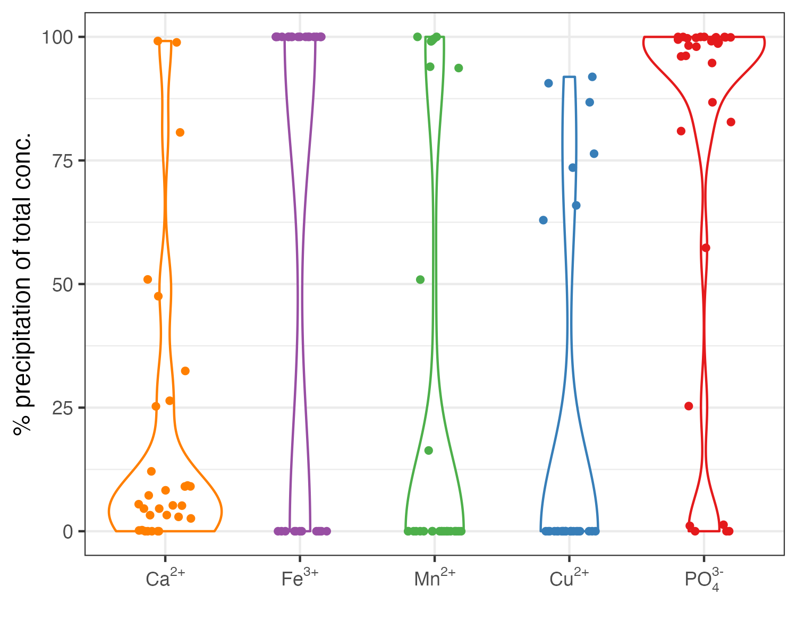

# Introduction
Aquaponics is a hybrid food production system, coupling aquaculture and soilless horticulture (hydroponics). In comparison with uncoupled, independent systems, advocates of the aquaponics principle with an aquaculture background claim that added value is created by preventing the release of aquaculture wastes into the environment but converting them into edible yield instead [@Turnsek2020]. The downside of this concept is, however, that the complexity of the system adds extra costs that render aquaponics uncompetitive under present circumstances when compared with conventional hydroponics [@Quagrainie2017].

One aspect contributing to high operating costs in aquaponics is the lack of simple “off-the-shelf” solutions for the management of plant nutrients.
As of today, the essentiality of 15 elements that are usually grouped into macro- and micronutrients, according to their abundance in plant tissues, is established for higher plants. Elements classified as macronutrients are carbon (C), hydrogen (H), oxygen (O), nitrogen (N), phosphorus (P), potassium (K), calcium (Ca), magnesium (Mg), and sulfur (S), while the micronutrients comprise iron (Fe), manganese (Mn), copper (Cu), zinc (Zn), molybdenum (Mo), and boron (B) [@Marschner2012]. The essentiality of nickel (Ni) and chloride (Cl) is currently under discussion [@Mengel2001]. 

In hydroponics, plant nutrients are supplied in form of commercially available and fine-tuned plant fertilizers with dosage recommendations. It is usually sufficient to monitor the nutrient depletion via plant uptake by determining the electric conductivity (EC) of the nutrient solution as sum parameter [@Resh2016]. In open-loop hydroponic systems, the depleted nutrient solution is eventually replaced. In closed-loop systems, on the other hand, the depleted nutrient solution is topped up with deficient nutrients and recycled [@Maucieri2019]. The management of closed-loop systems requires the frequent determination of concentrations of all individual plant nutrients over several growth cycles, but, considering that large-scale commercial hydroponic farms specialize on one crop, it leads to a large database that enables the farmer to amend nutrients at specific points of time based on experience, making frequent monitoring of single nutrients obsolete in the long run.

In aquaponic systems, the three main sources of nutrients are 1) the feed for the aquatic livestock, hereinafter denoted as aquafeed, 2) the source water, and 3) alkalinity supplements [@Eck2019]. These sources vary in their contribution to the total daily nutrient input, depending on the species reared and the location of the facility.

Aquafeeds are usually considered as of greatest importance in terms of nutrient input into aquaponic systems [@Schmautz2016; @Robaina2019]. Though, studies about the inclusion rates of plant nutrients in aquafeeds are scarce because these compounds are either not essential for aquatic animals or are taken up from water via the gills and they are thus usually not considered during feed formulation [@Lall2002]. **TABLE XXX** is summarizing some data with respect to average plant nutrient inclusion rates in fish feeds that was collected from commercial trout and salmon grower feeds [@Tacon1983]. Aquafeeds can vary in their composition due to the fact that the raw material composition of a specific feed might be altered because of availability and fluctuations in market prices of feed ingredients. While feed manufacturers allow variations of crucial nutrients such as the crude protein (CP) inclusion rate only within tight limits, this is not true for other nutrients that are disregarded in the formulation process. However, there is no available data about the ranges of microminerals in aquafeeds.

When discussing aquafeeds as nutrient input, it is important to consider the digestibility of the nutrients, their retention in animal tissue and the route of their excretion. As shown in **Figure XXX**, before becoming available for plant uptake, aquafeeds are ingested by the cultivated animal. The indigestible mass fraction is then excreted in form of solid matter. The digestible mass fraction is utilized to sustain the basal metabolism, somatic growth and reproductive activity of the animal and the metabolic end products are eventually excreted in form of dissolved matter via the gills and the urinary system [@Evans2003; @Hardy2002].


N that is, for the most part, present as CP, is usually well-digestible, with the apparent digestibility coefficient (ADC) of feed ingredients usually being above 70% and on average approximately 90% [@IAFFD2021; @Guillaume2001]. The excretion of N as end product of the protein and amino acid catabolism takes place in form of ammonia and, to a small extent, urea. The predominant excretory site are the gills, followed by renal excretion [@Dabrowski2002]. 

A less digestible nutrient is P with ADC estimates ranging from 70% to 40% and a resulting excretion of 30% to 60% of the supply [@Lall2002; @Sugiura2018]. Especially plant ingredients in aquafeeds can cause low ADC if they are rich in phytic acid. Phytic acid is poorly digestible and can furthermore reduce the digestibility of minerals in the feed. This might also explain contradictory information in literature with reported renal excretion rates of 90% of the total excreta [@Tomiyama1956] in contrast to  estimates of 28% of excretion taking place in dissolved form and 30% to 64% excreted as particulate P [@Dabrowski2002].

In terms of digestibility, information about the remaining plant nutrients is scarce. Variability of ADC among different feed ingredients was shown in Atlantic salmon (\emph{Salmo salar}) for Ca, Mg, Fe, Mn and Zn, with an ADC ranging between 30% to 50% [@Sugiura1998].

Excretion of the earth alkaline metals Ca and Mg takes primarily place in dissolved form via the gills and urine [@Lall2002; @Oikari1985]. Mn, in contrast, is mostly excreted in solid form as feces, while the renal excretion was found to be negligible [@Lall2002]. Cu is predominantly excreted via the bile [@Bury2003]. Excess dietary Cu is not taken up but excreted as feces. Thus the Cu inclusion rate in aquafeeds is reduced to minimize its release into the environment [@Lall2002]. Zn is mostly excreted renally and via the gills [@Lall2002].


Even though the source water is seen as of minor importance in terms of nutrient influx, it was found that a comparably large proportion of some plant nutrients such as Ca, Mg and S, can originate from source water [@Delaide2017]. 
Due to its low water demand, aquaponics is generally seen as food production system suitable for urban areas or arid regions [@Kloas2015; @Joyce2019]. Establishing an aquaponic system in these regions comes with limited access to water sources such as well water or rivers and lakes. Rainwater, on the other hand, would require large storage capacities. Tap water is thus assumed to be the most important water source.
The quality of tap water is usually rigidly regulated by the authorities. In Europe, the Drinking Water Directive is defining maximum allowable concentrations (MAC), setting threshold concentrations for several substances that could affect the consumers' health. Other MAC such as for Fe are of technical nature, where exceeding the limit could indicate for instance damages in the municipal water installation  [@EU2020]. **TABLE XXX** summarizes MAC of plant nutrients that are regulated by the Drinking Water Directive. 


**Average plant nutrient composition found in trout, salmon, and eel grower feeds [@Tacon1983] and maximum allowable concentrations (MAC) of substances considered as plant nutrients defined by the EU Drinking Water Directive [@EU2020].**

|Nutrient|Aquafeeds|Tap water (limit)|
|---|---|---|
|$\text{NO}_{3}^{-}$|-|50 mg L$^{-1}$|
|$\text{NO}_{2}^{-}$|-|0.5 mg L$^{-1}$|
|$\text{NH}_{4}^{+}$|-|0.5 mg L$^{-1}$|
|TIN|$64 \text{ g kg}^{-1}$ [^1]|50 mg L$^{-1}$ [^2]|
|P|13.26 g kg$^{-1}$|no MAC|
|K|9.83 g kg$^{-1}$|no MAC|
|Ca|17.75 g kg$^{-1}$|no MAC|
|Mg|2.13 g kg$^{-1}$|no MAC|
|$\text{SO}_{4}^{2-}$||250 mg L$^{-1}$|
|Fe|229 mg kg$^{-1}$|200 µg L$^{-1}$|
|Mn|96 mg kg$^{-1}$|50 µg L$^{-1}$|
|Cu|14 mg kg$^{-1}$|2 mg L$^{-1}$|
|Zn|163 mg kg$^{-1}$|no MAC|
|Ni|3 mg kg$^{-1}$|20 µg L$^{-1}$|

[^1]: Calculated based on an aquafeed with 40% CP (dry matter base) and the Kjeldahl factor 6.25.
[^2]: Calculated as [TIN] = [$\text{NH}_{4}^{+}$] + [$\text{NO}_{2}^{-}$] + [$\text{NO}_{3}^{-}$].


Tap water can vary in its composition, depending on its origin such as surface or groundwater. The extent of the variability of terrestrial waters in their chemical composition is shown in **FIGURE XXX**. Wheathering of rock, ion exchange, redox reactions and the buildup of biomass are the main processes that are affecting the concentrations of the shown compounds [@Stumm1981]. The highest variability can be found in anionic compounds such as nitrate ($\text{NO}_{3}^{-}$) and sulfate ($\text{SO}_{4}^{2-}$) and the cationic alkaline earth metals $\text{Ca}^{2+}$ and $\text{Mg}^{2+}$ that are covering a concentration range of approximately two orders of magnitude.


Lastly, the third continuous nutrient input are alkalinity supplements that are used to maintain a stable pH in the system [@Timmons2010]. The activity of nitrifying bacteria in the biofilter releases three moles of protons (H$^{+}$) per mole of ammonia (NH$_{3}$) that is converted to NO$_{3}^{-}$. This leads to a decrease in pH over time and consequently to a decrease in the activity of the nitrifyers [@Ward2011]. Thus, the released H$^{+}$ has to be neutralized to maintain a stable pH and ensure both high nitrification performance and the welfare of the fish stock. For this purpose, several Na-based alkalinity supplements such as sodium hydrogen carbonate (baking soda, NaHCO$_{3}$) are commonly used in aquaculture due to their high and rapid solubility and a comparably cheap price. However, high daily Na inputs should be avoided due to its phytotoxicity at high concentrations [@Maathuis2014]. Therefore, several other supplements based on K or Ca are used in aquaponics. **TABLE XXX** summarises some supplements, their properties and prices. These substances come with the advantage of providing additional plant nutrients while increasing the pH.


**Properties and prices of some Na based alkalinity supplements used in aquaculture and their K and Ca based alternatives for aquaponics. Prices from https://www.alibaba.com (accessed January 14th, 2023). All chemicals food grade and with a minimum order quantity of one kilogram. Reported is the cheapest sales price. Table adapted from Bisogni and Timmons, 1994.**

|Chemical Formula|Common Name|Solubility|Solubilization rate|Price|
|---|---|---|---|---|
|$\text{NaOH}$|sodium hydroxide|high|rapid|$\approx 0.30 \text{ EUR kg}^{-1}$|
|$\text{Na}_{2}\text{CO}_{3}$|sodium carbonate, soda ash|high|rapid|$\approx 0.20 \text{ EUR kg}^{-1}$|
|$\text{NaHCO}_{3}$|sodium bicarbonate, baking soda|high|rapid|$\approx 0.01 \text{ EUR kg}^{-1}$|
|$\text{KOH}$|potassium hydroxide|high|rapid|$\approx 0.60 \text{ EUR kg}^{-1}$|
|$\text{K}_{2}\text{CO}_{3}$|potassium carbonate|high|rapid|$\approx 0.50 \text{ EUR kg}^{-1}$|
|$\text{KHCO}_{3}$|potassium bicarbonate|high|rapid|$\approx 0.50 \text{ EUR kg}^{-1}$|
|$\text{CaCO}_{3}$|calcium carbonate, calcite|moderate|moderate|$\approx 0.13 \text{ EUR kg}^{-1}$|
|$\text{CaO}$|slaked lime|high|moderate|$\approx 0.10 \text{ EUR kg}^{-1}$|
|$\text{Ca(OH)}_{2}$|calcium hydroxide, hydrated lime|high|moderate|$\approx 0.25 \text{ EUR kg}^{-1}$|
|$\text{CaMg(CO}_{3})_{2}$|dolomite|moderate|slow|$\approx 0.10 \text{ EUR kg}^{-1}$|


Comparing the nutrient profile of plant-available fish excreta with nutrient concentrations used in conventional hydroponic systems, deficiencies were found [@Shaw2022; @Lunda2019; @Robaina2019; @Graber2009; @Bittsanszky2016]. This is in line with inconsistent results obtained in studies comparing the performance of aquaponic and hydroponic systems. For instance, basil yield was reported to be lower if grown in an aquaponic system [@Roosta2014]. For other leafy greens such as spinach, dill, rocket, coriander, parsley, and lettuce, no difference between plants grown in aquaponics versus hydroponics could be found [@Atique2022; @Lennard2019; @Maucieri2019a; @Anderson2017]. On the contrary, one study found higher lettuce yields in aquaponics compared with hydroponics [@Alcarraz201]. 

To counteract these imbalances, it was suggested to complement aquaponic nutrient solutions with the missing nutrients. Studies showed that this practice leads to plant growth equal or even better than observed in hydroponics [@Delaide2016; @Monsees2019; @Rodgers2022]. Though, the supplementation of individual nutrients requires their continuous monitoring to ensure that optimum levels are met and maintained. This adds additional expenses to the budget.


To circumvent the stated obstacles with respect to nutrient management in aquaponics, several suggestions were made such as the development of tailored aquafeeds, and usage of substances that are an alternative for the sodium hydrogen carbonate (soda, NaHCO$_{3}$) that is used in conventional aquaculture for pH control [@Seawright1998; @Goddek2019]. However, it needs to be emphasised that the development of an “off-the-shelf” solution for a problem implies that its application yields comparable results over a broad range of conditions. Therefore, three considerations are of striking importance within the context of an improved nutrient supply in aquaponics:

1. It is necessary to identify the nutrients that can be supplied without facing over- or undersupply due to variability in other nutrient sources that were not considered. Thus, the **source of nutrients** and their variability must be examined closely.
2. Independent from the supply route, it must be taken into account that the introduction of a substance into an aqueous system does not necessarily lead to an increase in its' concentration in solution. The **behavior of the nutrients** has to be considered.
3. The **fate of the nutrient** within the system under different system conditions and setups needs to be assessed to get a clear idea where and in what form the introduction of a substance leads to the greatest positive impact.


### Water


## Nutrient fate and behavior
Hydroponics literature highlights that an understanding of aquatic chemistry is crucial for successfull nutrient management [@Sambo2019]. The prerequisite for plant nutrients to be available for plant uptake via the roots is that they must be present in dissolved form. However, the concentration of dissolved substances underlies physico-chemical constrained. The most important reactions that are determining the concentration of plant nutrients in water are dissolution-precipitation, acid-base, and complex formation reactions. The following description of the named reactions intends to give a very brief introduction into their underlying mechanisms and their relevance for nutrient management. Describing these reactions in greater detail is out of scope of this manuscript. Further information can be obtained by consulting the dedicated literature [@Jensen2003; @Stumm1981].
Dissolution of a salt occurs if its ionic compounds are present in solution below a concentration denoting the saturation concentration of the same or another salt containing these ions. The saturation concentration of a salt can be described using solubility product constants $K_{sp}$, which are the product of the concentration of the cation(s) and the anion(s) at saturation concentration, as shown in **equation XXX**, with square brackets denoting for molar concentrations.


$$
K_{sp} = [cation^{n+}]^{m} \cdot [anion^{m-}]^{n}
$$

$K_{sp}$ is either determined empirically or derived from thermodynamic data. The saturation concentration $S$ of the salt can eventually be calculated by rearrangement of **equation XXX** as shown in **equation XXX**.


$$
S = \sqrt[m+n]{\frac{K_{sp}}{m^{m} \cdot n^{n}}}
$$

If the concentrations of the cation(s) and anion(s) in solution are known, it is possible to calculate the ion product $Q$ analogously to the calculation of $K_{sp}$ as shown in **equation XXX**, substituting $[cation]$ and $[anion]$ by the corresponding determined concentrations.


$$
Q = [cation^{n+}]^{m} \cdot [anion^{m-}]^{n}
$$

$K_{sp}$ can now be compared with $Q$ to evaluate whether the solution is saturated or not by calculating the saturation index $U$ as shown in **equation XX**. If the saturation concentration is exceeded ($Q > K_{sp}$ and $\log{\frac{Q}{K}} > 0$), precipitation occurs. 

$$
U = \log{\frac{Q}{K_{sp}}}
$$

The formation of a salt can also be seen as the result of a neutralisation reaction. The reaction of phosphoric acid (H$_{3}$PO$_{4}$) with sodium hydroxide (NaOH) can be written in a simplified way as 

H$_{3}$PO$_{4}$ + NaOH <-> NaH$_{2}$PO$_{4}$ + H$_{2}$O

, yielding sodium dihydrogen phosphate NaH$_{2}$PO$_{4}$ as product. A salt thus consist of the conjugated weak base (H$_{2}$PO$_{4}^{-}$) and acid (Na$^{+}$) of the strong acid (H$_{3}$PO$_{4}$) and base (NaOH) that led to its formation.


When its ions dissolve, or its strong acids or bases are introduced into the system, they are undergoing acid-base reactions with water. As an example, the reactions of trihydrogen phosphate  (H$_{3}$PO$_{4}$), commonly termed  phosphoric acid, with water are 

H$_{3}$PO$_{4}$ + H$_{2}$O <-> H$_{2}$PO$_{4}^{-}$ + H$_{3}$O$^{+}$ $K_{a1} = 10^{2.1}$

H$_{2}$PO$_{4}^{-}$ + H$_{2}$O <-> HPO$_{4}^{2-}$ + H$_{3}$O$^{+}$ $K_{a2} = 10^{7.2}$

HPO$_{4}^{2-}$ + H$_{2}$O <-> PO$_{4}^{3-}$ + H$_{3}$O$^{+}$ $K_{a3} = 10^{12.0}$

The reactions show that phosphate in aqueous solution is present in four different forms, the so-called species, which there are H$_{3}$PO$_{4}$, H$_{2}$PO$_{4}^{-}$, HPO$_{4}^{2-}$ and PO$_{4}^{3-}$. The extent to which the described dissociation reactions (the removal of H$^{+}$) occurs depends on the pH of the system and can be mathematically described by a characteristic equilibrium constant $K$ for each reaction step [@Jensen2003]. 
The species differ in their chemical behavior.


If, for instance, both PO$_{4}^{3-}$ and Fe$^{3+}$ ions are present in solution and $Q > K_{sp}$ , they will eventually form precipitates. This could be avoided by complex formation reactions where a chelating agent, hereinafter denoted as ligands, forms a complex molecule which is "hidden" and thus excluded from precipitation. Complex molecules are formed especially with cations of transition metal and they can lead to concentrations of these metals that are exceeding their saturation concentrations by three to four orders of magnitude (see e.g. Jensen, 2003).
The effects and constraints that are resulting from the described reactions under conditions that are typical for hydroponics were exhaustively described [@DeRijck1997; @DeRijck1998; @DeRijck1998a; @DeRijck1999b]. However, no such work has been conducted for aquaponics.


## Objectives
This review intended to identify the average contribution of different nutrient sources to the total daily nutrient input in aquaponic systems based on literature data. Special emphasis was given to the variability of the nutrient concentrations in tap water, depending on the geographical location.
To tackle the problem of nutrient imbalances in aquaponic systems, saturation indices of literature data were calculated in an attempt to find out whether the imbalances can be balanced by the supply of additional nutrients, for instance in form of feed, of if the occurrence of imbalances can be ascribed to physico-chemical boundaries such as precipitation reactions. 
Given these inputs, recommendations with regards to the formulation of tailored aquafeeds  and nutrient management in aquaponics shall be developed to enhance the overall performance and profitability of aquaponic systems.


# Methodology

```{r Setup, message=FALSE, warning=FALSE, include=FALSE}
#knitr::opts_chunk$set(echo = TRUE, include = FALSE)
knitr::opts_chunk$set(eval = FALSE)

source('R/init.R') # Load packages and functions

source('R/data_import.R') # Currently using gdata
source("R/wrangling_dom.R")
source("R/wrangling_precipitation.R")
source("R/wrangling_logQK.R")
```


## Software
All calculations were conducted using Visual MINTEQ (v3.1) and its default database and R (v4.2.2) with RStudio ("Spotted Wakerobin" Release) as graphical user interface.


## Raw data acquisition
Three datasets were created to approach the stated research questions: An aquaponic dataset, a source water dataset, and a feed dataset.

For the creation of the aquaponics dataset, literature was screened for studies that focussed on nutrient dynamics in aquaponic systems, resulting in 117 individual observations originating from 39 publications. Selected literature comprised studies about permanently and on-demand coupled freshwater aquaponics, sludge remineralisation studies and hydroponic growth trials with water originating from aquaculture systems. The pH, total water volume of the system, daily water exchange rate, initial bodyweight, stocking density, daily feeding rate, and the concentrations of all essential plant nutrients in the system water were gathered.

The source water dataset was compiled by merging 64 water analysis reports from 12 countries which are shown in **FIGURE XXX** together with number of observations per country. Even though it was intended to randomize the selection of water analysis reports, the authors had to consider the accessibility of the analysis reports due to lacking English versions.

{@fig:country}

The feed dataset comprised nutrient analyses of aquafeeds used during aquaponic studies. If commercial aquafeeds were used and only trade names reported, supplier datasheets were used and amended by literature data, if available. Incomplete observations with respect to experimental feeds were handled the same, merging data from multiple publications if the same feed was used.


## Origin of nutrients

### Assumptions, data selection and preparation
To create initial assumptions for the calculation of the relative contributions of feed and buffer substances to the daily nutrient input, empirical data from the aquaponics and feed datasets were used. 

```{r include=FALSE}
# Count observations
read_csv("interm/contribution_assumptions_raw.csv") %>%
  
  print() %>% 
  
  summarise(
    publications = length(unique(Reference_ID)),
    observations = n()
  ) %>% 
  
  print()
```


Arithmetic means of the pH, total volume of the aquaponic system, volume of daily exchanged water, daily mass of fed feed on dry matter basis, and nutrient mass fractions in the feed were calculated. To account for the digestibility of plant nutrients in aquafeeds by fish, apparent digestibility coefficients (ADC) of 90% were assumed for N whereas the ADC of all other plant nutrients was assumed to be 50% (Lall Fish Nutrition The Minerals, 2002).

The input of pH-increasing substances was assumed to be correlated with the daily feed input. It was furthermore assumed that the entire indigestible fraction of N is excreted in form of NH$_{4}^{+}$. The necessary amounts of KOH and Ca(OH)$_{2}$ to neutralise the released protons were calculated.


In water analysis, it is common practice to report the value of the detection limit instead of the measured value in case that the analyte concentration found was below the sensitivity of the instrument used for measurement [@DIN32645]. Retaining the detection limits in the dataset leads to mean concentration estimates that are too large. However, removing the affected observations would result in a loss a large proportion of the data, as shown in **FIGURE XXX**. Therefore, concentration data was recalculated using the *cenmle()* function from the R package *NADA* by maximum likelihood estimation (MLE) [@Helsel2012]. This ensured that the estimates for nutrient concentrations in tap water were reliable. The output was eventually used to calculate the two-sided 90% confidence interval for the concentration of each nutrient to describe the concentration range that will be found in 90% of all cases where tap water is used.


## Fate and behavior of nutrients

### Assumptions and data selection
Due to aeration of the RAS tanks and the oxygen requirements of the livestock and nitrifyers, it was assumed that aerobic conditions are predominant in all systems. This would lead to the presence of metals in their reduced forms, e.g. [Fe$^{3+}$] >> [Fe$^{2+}$]. Furthermore, it was assumed that CO$_{2}$ in solution is in equilibrium with CO$_{2}$ in the atmosphere. According to Henry's Law, this would result in a concentration of [CO$_{2}$(aq)]$_{total} = K_{H} \cdot p_{\text{CO}_{2}} = 0.018$ mol L$^{-1}$, assuming a partial pressure $p_{\text{CO}_{2}} = 0.054$ atm and the corresponding Henry constant of $K_{H} = 3.4 \cdot 10^{-2}$ mol L$^{-1}$ atm$^{-1}$ [@Stumm1981].
 
```{r include=FALSE}
references <- data.frame(refs = list.files("data"))

references %>% 
  separate(refs, into = c("author", "treatment"), sep = "(?<=[[:digit:]]{4})") %>% 
  summarise(
    unique(author)
  )
```

Data from the aquaponics dataset was used and observations originating from aquaponic studies were limited to those making use of an on-demand coupled system design to ensure that measured analyte concentrations were not impacted by plant uptake. Furthermore, anaerobic treatments were excluded from data originating from sludge remineralisation studies. The number of observations in the initial dataset was further reduced by excluding those that did not report pH, leading to a final dataset of 25 observations originating from 16 publications. 


### Complexation by dissolved organic matter
The complexation of plant nutrients by dissolved organic matter (DOM) was simulated using the Gaussian DOM model [@Grimm1991]. It was assumed that DOM is present in the systems at a concentration of 20 mg L$^{-1}$. The charge of the DOM species was calculated according to database values.


### Mineral saturation and precipitation
To assess whether the waters in the selected literature were saturated with regards to specific minerals, mineral saturation indices $\log(\frac{Q}{K})$ were calculated. The saturation index of a mineral is the ratio between its ion product $Q$ and its solubility product $K_{sp}$. $Q$ can be generally expressed as follows 


$$
Q = [\text{cation}(aq)]^n \cdot [\text{anion}(aq)]^m
$$

where the expressions in square brackets denote for the empirically found concentrations of the cationic and anionic components of a mineral taken to the power of their stoichiometric coefficients $m$ and $n$. For instance, a concentration of [Fe$^{3+}$] = [PO$_{4}^{3-}$] = 0.1 mol $\text{L}^{-1}$ would result in $Q = [\text{Fe}^{3+}]^1 \cdot [\text{PO}_{4}^{3-}]^1 = 0.01 \text{ mol}^2 \text{ L}^2$. $K_{sp}$ is calculated analogously to the ion product but with concentrations denoting for the saturation concentration that is reached when a solid mineral equilibrates with its dissolved ions. If $\log(\frac{Q}{K}) = 0$, the concentration of ions is higher than their solubility under equilibrium conditions. The solution is thus not thermodynamically stable and the correpsonding mineral is precipitating. On the other hand, if $\log(\frac{Q}{K}) < 0$, more of the solid mineral can dissolve until the equilibrium concentration is reached. In case that $\log(\frac{Q}{K}) > 0$, there are other factors such as complexation reactions that are increasing the solubility.

All observations that were affected by precipitation ($\log(\frac{Q}{K}) = 0$) were eventually tested with regards to the concentration proportion that precipitated of the affected nutrient. 


# Results

## Derived assumptions

```{r include=FALSE}
assumptions <- read_csv(here::here("results", "contribution_assumptions_summary2.csv")) %>% 
  print()
  
read_csv(here::here("results", "contribution_assumptions_summary2.csv")) %>% 
pivot_wider(names_from = "name", values_from = "value") %>% 
  mutate(
    water_per_feed_m3_kg = meanFeed_kg_d / meanFreshwater_m3_d
  ) %>% 
  pivot_longer(everything(),
               names_to = "name",
               values_to = "value") %>% 
  print()
```

Assumptions were derived from studies about aquaponic systems to calculate contributions of nutrient sources to daily nutrient inputs into the system.
Analysis of the data presented in the reviewed aquaponics studies revealed that the average total water volume of the aquaculture systems was 4.53 m$^{3}$ with an average volume of the rearing compartment of 2.81 m$^3$. An average stocking density, calculated as the average of the initial and final density, of 7.69 kg m$^{-3}$, feeding rate of 2%, and water exchange rate of 3% were found. 


```{r include=FALSE}
read_csv(here::here("results", "contribution_species.csv")) %>% 
  
  group_by(group) %>% 
  #mutate(sum = sum(n()))
  summarise(
    n = n()
  ) %>% 
  mutate(sum_n = sum(n)) %>% 
  group_by(group) %>% 
  summarise(perc = round(n/sum_n * 100, digits = 2))
  
```

As shown in **FIGURE XXX**, literature data comprised a total of nine different cultivated fish species, of which four were cyprinids, three percids, one silurid and salmonid species, respectively. Percid fish were cultivated in 63% and Silurids in 23% of the studies, while Cyprinids were used in 10% and Salmonids in only 2% of the studies.


## Nutrient sources
Using the assumptions derived from literature, an average biomass of 40.98 kg and daily inputs of $40.98 \text{ kg} \cdot 2\% = 0.8$ kg of feed with an average crude protein content of 41% on dry matter basis and $4.53 \text{ m}^{3} \cdot 3\% = 0.14 \text{ m}^{3}$ of freshwater were calculated. 

The daily feed input and crude protein content resulted in a daily N input of $\frac{0.8 \text{ kg d}^{-1} \cdot 41\%}{6.25} \cdot 1000 \frac{\text{g}}{\text{mg}} = 52.4 \text{ g d}^{-1}$. 
Nitrification, under the assumption that This generated H$^{+}$ required $\frac{52.4 \text{ g}}{14 \text{ g mol}^{-1}} = 3.7$ mol d$^{-1}$ of H$^{+}$ to be neutralized. For this purpose, the input of the same amount of $\text{NaHCO}_{3}$, KOH or half of Ca(OH)$_{2}$ would be required, resulting in an input of 190.5 g d$^{-1}$ K or 97.6 g d$^{-1}$ of Ca.


```{r include=FALSE}
# Mean and upper and lower limits of 95% confInt.
# Data in mg/L
read_csv(here::here("interm", "contribution_water.csv")) %>% 
  mutate(
    lowInput_g_day = lconf * 4400 / 1000,
    meanInput_g_day = mconf * 4400 / 1000,
    highInput_g_day = hconf * 4400 / 1000
  )
```


The average nutrient composition of both aquafeeds and source water and the lower and upper limits of the 95% confidence interval for source water are shown in **TABLE XXX**. 
It is evident that the highest daily nutrient input usually originates from the aquafeeds


**Compositions of nutrient sources and daily inputs. Shown are the averages for both aquafeeds and source water and the lower and upper limits of the 95% confidence interval for the source water.**
Source water: n = 64;Aquafeeds: n = 54

|Nutrient|Aquafeeds|Source water|pH management|Aquafeeds daily|Source water daily|pH management daily|
|---|---|---|---|---|---|---|
|N|66.3 g kg$^{-1}$|1.2 mg L$^{-1}$ [0.8, 1.7]|-||5.680 g d$^{-1}$|-|
|P|8.8 g kg$^{-1}$|95.2 µg L$^{-1}$ [34.4, 156.0]|-||0.419 g d$^{-1}$|-|
|K|7.1 g kg$^{-1}$|2.6 mg L$^{-1}$ [1.8, 3.4]|||11.685 g d$^{-1}$|487.0 g d$^{-1}$|
|Ca|15.9 g kg$^{-1}$|64.4 mg L$^{-1}$ [55.6, 73.2]|||283.477 g d$^{-1}$|249.6 g d$^{-1}$|
|Mg|2.0 g kg$^{-1}$|11.5 mg L$^{-1}$ [9.4, 13.6]|-||50.644 g d$^{-1}$|-|
|S|3.9 g kg$^{-1}$|14.2 mg L$^{-1}$ [10.7, 17.8]|-||62.763 g d$^{-1}$|-|
|B|17.1 mg kg$^{-1}$|48.9 µg L$^{-1}$ [34.6, 63.3]|-||215.5 mg d$^{-1}$|-|
|Fe|291.3 mg kg$^{-1}$|18.7 µg L$^{-1}$ [12.3, 25.1]|-||82.5 mg d$^{-1}$|-|
|Mn|71.9 mg kg$^{-1}$|5.8 µg L$^{-1}$ [2.9, 8.7]|-||25.6 mg d$^{-1}$|-|
|Cu|14.3 mg kg$^{-1}$|22.4 µg L$^{-1}$ [0, 45.7]|-||98.7 mg d$^{-1}$|-|
|Zn|169.7 mg kg$^{-1}$|13.9 µg L$^{-1}$ [0, 28.2]|-||61.5 mg d$^{-1}$|-|
|Mo|1.7 mg kg$^{-1}$|0.7 µg L$^{-1}$ [0.5, 1.0]|-||0.3 mg d$^{-1}$|-|
|Ni|0.9 mg kg$^{-1}$|1.6 µg L$^{-1}$ [1.0, 2.2]|-||7.4 mg d$^{-1}$|-|
|Na||25.5 mg d$^{-1}$|-||112.343 g d$^{-1}$|286.3 g d$^{-1}$|


**Figure XXX** visualises the proportion of the daily total nutrient inputs from each nutrient source after consideration of aquafeed digestibility.
The results confirm that aquafeeds were the main nutrient source in the reviewed studies. Considering the range of the possible nutrient contribution by source water that is given by the upper and lower limits of the 95% confidence interval, it was found that aquafeeds provided between 99.8% and 99.9% of N, 99.7% and 99.9% of P, 94.4% and 94.4% and 96.8% of K. They were thus contributing almost nearly the total amount of the most important macronutrients. In addition, aquafeeds were the main contributors to the daily total input of Fe (98.9% to 99.4%), Mn (98.5% to 99.5%), Mo (93.0% to 96.4%), and Zn (98.0% to 100%). The variability for these plant nutrients was comparably low.
The most variable plant nutrient with respect to its source concentration was found to be Cu with a contribution of aquafeeds between 71.9% and 100% to the total daily inputs. The variability of the following plant nutrients decreased in descending order: B (68.8% to 80.1%), Ni (75.5% to 86.6%), S (64.1% to 74.8%), Mg (54.0% to 62.9%), and Ca (64.1% to 70.1%).
Interestingly, aquafeeds were found not to be the predominant input route of Na (38.4% to 55.7%) on average. 
show the same plots under addition of KOH and Ca(OH)$_{2}$ to adjust the pH, respectively.
It becomes evident that the addition of pH adjusting substances results in them becoming the main input route of the cation they are containing (K, Ca or Na).
decreasing the share of the feed from XXX% to YYY% if KOH is added. The use of Ca(OH)$_{2}$ leads to only half of the molar input of Ca compared to K as its hydroxide contains two hydroxide ions. However, it is still contributing almost 100% of the daily total Ca input while the shares of feed and water are dropping to XXX% and YYY%, respectively.


![Relative contribution of source water, feed and substances for pH management to the total daily nutrient input in aquaculture and aquaponic systems. Shown are scenarios reflecting the lower and upper limit of the 95% confidence interval of concentration data for source water. Data derived from water analysis (n = 69) and feed analysis reports (n = 9), taking digestibility into account, assuming 90% apparent digestibility of N, 50% apparent digestibility of all other plant nutrients, 100% purity and no contribution of pH management substances to other nutrient inputs.](plots/contribution_sources_digestincl.png)

```{r eval=FALSE, include=FALSE}

read_csv(here::here("results", "contribution_plotdata.csv")) %>% 
  mutate(water = factor(water, labels = c("water5", "water95"))) %>% 
  
  group_by(water, nutrient, Contribution) %>% 
  summarise(
    #contrib = Contribution,
    #Total = unique(Total),
    sum = sum(Total), 
    prop_perc = Total/sum * 100
  )
```


## Fate and behavior of nutrients
The proportion of potential cation complexation by DOM was calculated to assess the possible impact of DOM on the solubility of plant nutrients in the reviewed studies. The results are shown in **FIGURE XXX**.

```{r include=FALSE}
read_csv(here::here("results", "dom.csv")) %>% 
  group_by(species_name) %>% 
  summarise(
    min = min(percentage_of_total_conc),
    median = median(percentage_of_total_conc),
    mean = mean(percentage_of_total_conc),
    sd = sd(percentage_of_total_conc),
    max = max(percentage_of_total_conc)
  )
```


Under the given assumption of a DOM concentration of $20 \text{ mg L}^{-1}$ and the use of a Gaussian DOM model, five cationic nutrients, namely Ca, Mg, Fe, Cu and Zn, were found to be possibly affected by DOM. 
The highest average affinity for the formation of complex molecules was found for Cu with a complexed proportion of $42.6\% \pm 33\%$ of the total concentration in solution, followed by Ca ($21.2\% \pm 18\%$) and Zn ($11.9\% \pm 14\%$). These three compounds also showed the highest variability with respect to their interactions with DOM. Based on the model predictions, less interaction with DOM was found between Mg ($3.0\% \pm 6\%$) and Fe ($0.1\% \pm 0.1\%$). 


After determination of the proportion of plant nutrients masked by complexation, making them unavailable for precipitation, mineral saturation indices were calculated. This was to assess whether the solubility of a plant nutrient is controlled by the formation of precipitates, thus not enabling further dissolution. **FIGURE XXX** visualises the results, showing calculated $\log(\frac{Q}{K})$ values for cationic plant nutrients with the corresponding precipitate-forming anions. 

```{r eval=FALSE, include=FALSE}
read_csv(here::here("results", "logQK.csv")) %>%
  filter(cation == "Fe+3")
  
  drop_na() %>% 
  mutate(
    saturated = if_else(logQK > 1, 1, 0)
    ) %>% 
  
  group_by(cation,anion) %>% 
  summarise(
    median = median(logQK),
    quant3 = quantile(logQK, 0.75),
    max = max(logQK)
  )
```


The results indicate that maximum solubility of Ca, Fe and Cu was reached in several studies. In this context, the solubility of Ca appears to be controlled by the formation of carbonates due to the proximity of the $\log(\frac{Q}{K})$ values to zero. The formation of phosphates was found to control the solubility of Fe, while both oxide and hydroxide formation determined the solubility of Cu. The solubility of Mn cannot be explained by the formation of precipitates and was thus likely controlled by formation of complex molecules. Zn solubility might have been controlled by the formation of carbonates and phosphates in few cases. However, the 75% quantile value of the saturation index of -1.73 and -2.45 for carbonates and phosphates, respectively, indicates that the maximum concentration was not reached. Instead, the true concentration reached only $10^{-1.73} \cdot 100\%$ = `r round(10^(-1.73) * 100, digits = 2)`% of the maximum saturation.

Those plant nutrients that were affected by precipitation were tested for the proportion of their total concentration that is expected to precipitate. The distribution of the obtained results is clearly bimodal as visible in **FIGURE XXX**. The median will thus be used in the following.


```{r include=FALSE}
read_csv(here::here("results", "precipitation.csv")) %>% 
  filter(component %in% c("Ca+2","Fe+3","Mn+2","Cu+2","PO4-3")) %>% 
  group_by(component) %>% 
  summarise(
    dissolved = mean(total_dissolved),
    precipitated = mean(total_precipitated),
    min = min(percentage),
    `1stQuart` = quantile(percentage, 0.45),
    median = median(percentage),
    mean = mean(percentage),
    sd = sd(percentage),
    max = max(percentage)
  )

read_csv(here::here("results", "precipitation.csv")) %>% 
  filter(component %in% c("Ca+2","Fe+3","Mn+2","Cu+2","PO4-3")) %>% 
  mutate(
    null = if_else(percentage < 1, 1, 0)
  ) %>% 
  group_by(component) %>% 
  summarise(
    n = n(),
    sum = sum(null),
    prop = sum/n*100,
    median = median(percentage)
  )
  
```

Overall, the plant nutrient that is affected most by precipitation was $\text{PO}_{4}^{3-}$. Within the reviewed dataset, the median of the calculated percentage precipitation was $98.0\%$, meaning that in 50% of the studies more than $98.0\%$ of $\text{PO}_{4}^{3-}$ precipitated. On the other hand, in 12% of the studies $\text{PO}_{4}^{3-}$ precipitation was found not to occur at all.
A similar picture was observable for $\text{Fe}^{3+}$. Here, no precipitation was expected to take place in $45\%$ of the observations. However, in all other cases, $\approx100\%$ of $\text{Fe}^{3+}$ was predicted to precipitate.
Much less prone for precipitation were $\text{Ca}^{2+}$, $\text{Cu}^{2+}$ and $\text{Mn}^{2+}$. Here, the median percentage precipitation was $5.2\%$ in case of $\text{Ca}^{2+}$, and $0.0\%$ in case of $\text{Cu}^{2+}$ and $\text{Mn}^{2+}$, respectively. 





# Discussion


## Sources of nutrients
The contribution of different nutrient sources to the total daily nutrient inputs into an aquaponic system were compared based on assumptions derived from literature.
Overall, the current input scenario confirms that fish feed is the major nutrient input route. Though, the results reveal that the source water is contributing an average of 50% of the total Na input, 30% of the Ca, 40% of Mg and 30% of S. Considering that salinity stress, ergo high Na concentrations, are toxic for most plants [@Wu2018], it is desirable to limit the influx into the system.
In the following, the assumptions are discussed. The average stocking density of 12.4 kg m$^{-3}$ that was used for the nutrient contribution calculations can be considered representative for the intensive cultivation of *Oreochromis* spp. (El-Sayed, 2019). 
This is different for *Clarias gariepinus*. The latter can be cultivated at stocking densities that are approximately ten times higher (~120 kg m$^{-3}$) without any adverse effects on fish health [@Nieuwegiessen2009].
*Sander lucioperca* is a species for which low stocking densities (~5 kg m$^{-3}$) are recommended [@Kestemont2015].
Even though salmonids such as *Oncorhynchus mykiss* are seldom reared in aquaponic systems, they can tolerate stocking densities up to 137 kg m$^{-3}$. Though, normal stocking densities  range between 10 and 20 kg m$^{-3}$. The assumptions are rather on the lower end for salmonids [@Pennell1996].
*Cyprinus carpio* is an irrelevant species for aquaponic systems due to its low market price. Though, it was found that fish welfare can be guaranteed at a stocking density of around 28 kg m$^{-3}$, which is 2.3 times higher than the assumed density [@Ruane2002]. 
It can thus be expected that the contribution of feed to the total daily nutrient input in case of  *C. gariepinus*  and *C. carpio* is considerably higher than assumed due to rearing conditions in the reviewed studies that are not representative for production  at commercial scale. In contrast, the assumptions might lead to an overestimation of the contribution of aquafeeds if *S. lucioperca* is the species of choice. 
Another aspect with respect to the contribution of feeds is that the feed composition is variable, depending on the selected species. Crude protein inclusion rates in commercial aquafeeds for the mentioned species range from $32\%$ for *C. carpio* [@Wilson2002] to $50\%$ for percids  [@Geay2015].


The current input scenarios are 


The current input scenario lacks the consideration of the water removal step during the water exchange. This might, in reality, lead to a dilution of the nutrients if the concentrations in the system are higher than those in the source water. On the other hand, the source water could be a real addition of nutrients to the system if the concentration of nutrients in the system would drop below the concentration in the source water. This could, for instance, be the case due to plant uptake or other means of nutrient removal from the water column.
The total nutrient input calculations are therefore only valid if there is no nutrient loss through the removal of water but instead full retention of all nutrients within the system. This could be possible in systems where only evaporated water is refilled. However, such a scenario would come with a much lower water input rate than currently assumed.


## Fate and behavior of nutrients
Nutrient imbalances are mentioned as causative factor for inconsistent performance of aquaponic systems. It was thus intended to pinpoint whether those imbalances occur due to lacking supply or due to physico-chemical constraints that are controlling the maximum concentration of the affecteed nutrients. Considering that aquaponic systems contain DOM, complexation percentages of plant nutrients by DOM were calculated to identify the proportion of plant nutrients available for precipitation reactions. Saturation indices were eventually calculated to identify saturated nutrients. Those were finally assessed with respect to the percentage saturation to find out what proportion of these nutrients might remain in solution. 
The limitations of Ca, Fe and Cu that were found in the scope of this study are in line with previous publications [@Goddek2015; Bittsanszky2016]. Empirical studies  intending to manipulate the concentrations of these compounds by increasing their inclusion rate into aquafeeds could not find an effect [@Seawright1998].


that could not find an increase in the concentration of these compounds in solution if the feed inclusion rate was increased (Shaw, Seawright). Nutrient imbalances appear thus to be a result of chemical constraints. It can be further hypothetised that reported nutrient losses are due to the formation of precipitates in the system [@Delaide2017]. If precipitation occurs in inaccessible places such as the inside of pipes or other surfaces, these nutrients will not be taken into account when analysing, for instace, sludge samples. The nutrients would, however, not be lost but instead they are deposited out of reach.
On the other hand, considering the positive saturation index values that were found for Fe and Mn, it is likely that other factors are controlling their solubility. Both ions might be kept in solution due to organic matter that is a natural ligand, forming chelates. However, this would lead to an increase in dissolved phosphate that might eventually form precipitates with other compounds or could be taken up by plants. 


## Implications for the formulation of tailored aquaponics feeds
The formulation of a dedicated aquaponics feed is seen as potentially user-friendly and rapid way of adding nutrients to the system, resulting in close-to optimum concentrations for the plants.

It is reasonable to focus on well-soluble nutrients that were not found to be constrained by precipitation reactions. Potential candidates that are fulfilling these requirements are alkaline metals such as K. The solubility of salts containing K is usually within the range of several grams per liter. Losses of K due to the formation of precipitates is thus unlikely. Other studies confirmed that the concentration of K in solution can be altered by different inclusion rates of K [@Seawright1998; @Shaw2022]. The same was also suggested by the nutrient release coefficient concept that was recently suggested [@Cerozi2022].
However, considering the contribution of feed in comparison to the contribution of KOH, if used for pH management, it is questionable what makes more sense

Another alkaline metal that is of interest with respect to aquapfeeds tailored for aquaponics is Na. 

Explicitly considering an increased delivery of plant nutrients other than K might be counterproductive, considering the potential precipitation of these nutrients. 


## Implications for the management of aquaponic systems

In general, lowering the pH in the aquaculture unit would mobilize nutrients. Even though it is reported that the activity of nitrifyers is impaired under acidic conditions, it was also found that there are 


## Future research needs
Aquaponics is an interdisciplinary field, combining both aquaculture and horticulture but also aquatic chemistry. The implications arising from chemistry are, however, not examined. Data is lacking as even studies dedicated to nutrient cycling in aquaponics are not following best practices with respect to reporting of analytical results, with lacking standard deviations, lacking detection and quantification limits of their methods and alike. 
With respect to more accurate data, usually only averaged nutrient concentrations are reported, while the evolution of nutrient concentrations over time is of greater interest due to the kinetics of certain reactions.
In terms of chemical modeling, temperatures, and pH values 
It is, however, necessary to understand the chemistry of aquaponic systems. 

Furthermore, there is no published study that is assessing the effects of organic matter in aquaponic systems. Besides pH, the key difference between aquaponic and hydroponic systems is the concentration of organic matter in the water. Organic matter is the main chelating agent and main factor affecting the mobility of metals. Water from aquaculture is much richer in organic matter than natural waters. Its effects should therefore be assessed.

Lastly, it is questionable whether the total concentration of the nutrients is actually of importance for plants. It was reported that a reduction of macronutrient concentrations to 50% of the control level does not have no adverse effect on growth, fruit yield and fruit quality in tomato (Siddiqi et al., 1998). The stoichiometry of nutrient solutions might thus play a more vital role for plants than currently known.


# References
