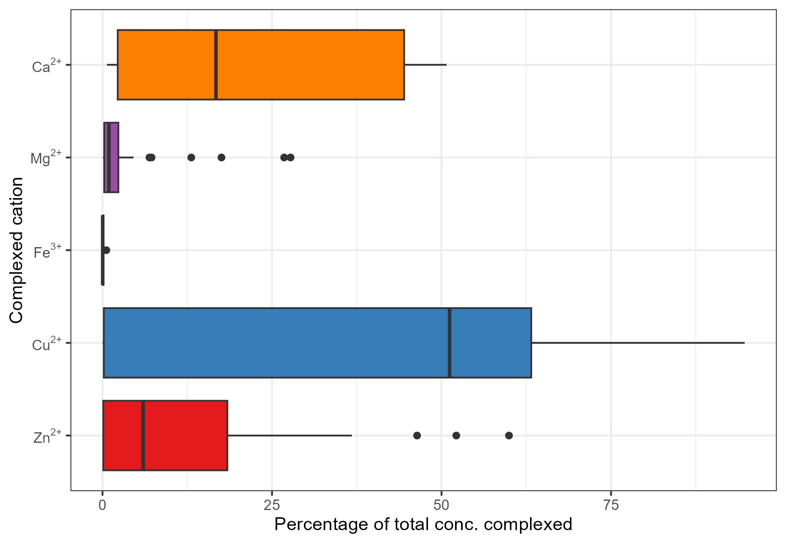

# Introduction
Aquaponic systems require a high initial investment and come with comparably high labor costs due to the complexicity of the system (Turnsek et al., Quagrainie, 2017). One aspect that is contributing to high operating costs in aquaponics is the lack of “off-the-shelf” solutions for the management of plant nutrients. 
As of today, the essentiality of 15 elements that are usually grouped into macro- and micronutrients, according to their abundance in plant tissues, is established for higher plants. Elements classified as macronutrients are carbon (C), hydrogen (H), oxygen (O), nitrogen (N), phosphorus (P), potassium (K), calcium (Ca), magnesium (Mg), and sulfur (S), while the micronutrients comprise iron (Fe), manganese (Mn), copper (Cu), zinc (Zn), molybdenum (Mo), and boron (B). The essentiality of nickel (Ni) and chloride (Cl) is currently under discussion (Mengel and Kirkby, 2001). 
The main source of nutrients in aquaponics is claimed to be the feed for the aquatic livestock, hereinafter denoted as aquafeed. Before becoming available for plant uptake, aquafeeds are ingested by the cultivated animals and the digestible mass fraction is utilized for the basal metabolism or somatic growth (Fish Nutrition). The indigestible mass fraction is excreted in form of both solid and dissolved matter, with the latter eventually being available for plant uptake. However, comparing the nutrient profile of plant-available fish excreta with nutrient solutions commonly used in hydroponics, deviations from the optimum were reported (Shaw et al., 2022; Lunda et al., 2019; Robaina et al., 2019). To counteract these imbalances, it was suggested to complement aquaponic nutrient solutions with the missing nutrients. Studies showed that this practice leads to plant growth equal or even better than observed in hydroponics (Delaide, 2016; Monsees, 2019; Rodgers, 2022). Though, the supplementation of individual nutrients requires their continuous monitoring to ensure that optimum levels are met and maintained. This adds additional expenses to the budget.
In hydroponics, on the other hand, plant nutrients are supplied in form of commercially available and chemically fine-tuned plant fertilizers with dosage recommendations. It is usually sufficient to monitor the nutrient depletion via plant uptake by determining the electric conductivity (EC) of the nutrient solution as sum parameter (Resh, 2013). Taking into account that labour costs can be accounted for 40-50% of the total operational costs of aquaponic facilities (Baganz 2020; Engle; Quagrainie, 2017), an entrepreneur who is carefully weighing whether to invest in aquaponics or hydroponics might opt for the latter.
To circumvent the stated obstacles with respect to nutrient management in aquaponics, several suggestions were made such as the development of tailored aquafeeds, and usage of substances that are an alternative for the sodium hydrogen carbonate (soda, NaHCO$_{3}$) that is used in conventional aquaculture for pH control (Seawright, 1998; Goddek et al., 2019). However, it needs to be emphasised that the development of an “off-the-shelf” solution for a problem implies that its application yields comparable results over a broad range of conditions. Therefore, three considerations are of striking importance within the context of an improved nutrient supply in aquaponics:

1. It is necessary to identify the nutrients that can be supplied without facing over- or undersupply due to variability in other nutrient sources that were not considered. Thus, the **source of nutrients** and their variability must be examined closely.
2. Independent from the supply route, it must be taken into account that the introduction of a substance into an aqueous system does not necessarily lead to an increase in its' concentration in solution. The **behavior of the nutrients** has to be considered.
3. The **fate of the nutrient** within the system under different system conditions and setups needs to be assessed to get a clear idea where and in what form the introduction of a substance leads to the greatest positive impact.


## Sources of nutrients
The three main sources of nutrients in any system related to aquaculture are 1) the source water, 2) aquafeeds, and 3) chemicals that are used for pH control. These sources differ both in their proportion of the contribution of nutrients and also in their location-dependent variability. Considering the variability in the composition of a nutrient source, identifying the range to be expected is of importance to ensure that a site-specific nutrient deficiency or toxicity due to depletion or accumulation under constant input of the same nutrient by another source, e.g., via feeding, can be avoided.

### Water
The source water of aquaponic systems is commonly referred to as of minor importance with respect to its contribution to the total nutrient input (Schmautz, 2016, Robaina et al., 2019). However, it was found that a comparably large proportion of some plant nutrients such as Ca, Mg and S, can originate from source water (Delaide, 2016). 
Aquaponics is generally seen as food production system suitable for urban areas or arid regions due to its low water demand (Kloas, 2015; Joyce et al., 2019 Aquaponics Food Production). Establishing an aquaponic system in these regions comes with limited access to certain water sources such as well water or other sources of freshwater such as rivers and lakes. Rain water, on the other hand, would require a large storage capacity which is not cost-efficient in arid regions and not realisable in urban areas due to very high land prices. Tap water can thus be assumed to be the most important water source.
Potable water is usually rigidly regulated by the authorities. In Europe, the Drinking Water Directive (EU XXX) is defining maximum allowable concentrations (MAC) for this purpose, setting treshold concentrations for several substances that could affect the consumers' health or pollute the environment. Other MAC such as for Fe are of technical nature, where exceeding the limit could indicate for instance damages in the municipal water installation. **TABLE XXX** summarizes MAC of plant nutrients that are regulated by the Drinking Water Directive. 


**Maximum allowable concentrations (MAC) of substances considered as plant nutrients defined by the Drinking Water Directive.**

|Nutrient|Limit|
|---|---|
|Cu|2 mg L$^{-1}$|
|Ni|20 µg L$^{-1}$|
|NO$_{3}^{-}$|50 mg L$^{-1}$|
|NO$_{2}^{-}$|0.5 mg L$^{-1}$|
|NH$_{4}^{+}$|0.5 mg L$^{-1}$|
|Fe|200 µg L$^{-1}$|
|Mn|50 µg L$^{-1}$|
|SO$_{4}^{2-}$|250 mg L$^{-1}$|


Within the legal requirements, the composition of tap water generally varies between locations and extraction point of the water. Processes such as wheathering of rock, ion exchange, redox processes and the buildup of biomass are  The extent of the variability is shown in **FIGURE XXX**.  These variabilities were not considered when investigating input sources of nutrients in aquaponics. 


### Feed
Aquafeeds are usually considered as main nutrient input in aquaponic systems (Robaina et al., 2019). **TABLE XXX** is summarizing some data with respect to average plant nutrient inclusion rates in fish feeds that was collected from commercial trout and salmon grower feeds (Tacon, 1983). However, aquafeeds can vary in the composition of certain nutrients due to the fact that the feed ingredient composition of a specific feed might be altered due to availability and fluctuations in market prices of feed ingredients. This comes with the need to replace feed ingredients by others. While the feed composition is usually only affected marginally, maintaining the levels of crude protein, lipids, ash and carbohydrates relatively constant, there is no information regarding micronutrients. Thus, the quality and composition of aquafeeds might even differ among batches produced at the same factory. Though, there is no available data about the ranges of microminerals in aquafeeds.

**Average plant nutrient composition found in trout, salmon, and eel grower feeds**

|Nutrient|Mass fraction|
|---|---|
|P|13.26 g kg$^{-1}$|
|K|9.83 g kg$^{-1}$|
|Ca|17.75 g kg$^{-1}$|
|Mg|2.13 g kg$^{-1}$|
|Fe|229 mg kg$^{-1}$|
|Mn|96 mg kg$^{-1}$|
|Cu|14 mg kg$^{-1}$|
|Zn|163 mg kg$^{-1}$|
|Ni|3 mg kg$^{-1}$|


When discussing feed as input route, it is furthermore important to consider its digestibility and the route of excretion. Aquatic animals excrete nutrients both in ionic form via their gills and as solid feces. Consequently, excreted nutrients differ in their plant availability according to the major pathway of excretion.

- Ca excreted primarily via gills and kidney (Lall 1989)
- Cu toxicity 13 mg/kg feed (Tacon 1990), 655 mg/kg feed (Knox et al., 1982, Lanno et al., 1985), 1 mg/L (Fiedman and Shibko, 1972); excess dietary Cu is not taken up but excreted as feces (Lall), thus Cu is reduced in feeds to minimise excretino into environment
- Mg renal excretion (Oikari and Rankin 1985)
- P 90% excretion via urine (Lall 1989; tomiyama et al. 1956); 30-64% of P excreted as particulate P; 28% P supplied via feed is wasted in dissolved form (Lall)
- Zn excreted by kidneys and gill chloride cells and feces 
- Mn renal excretion is negligible (Lall), instead feces


### Substances for pH management (Recirculation aquaculture for citation)
The biofilter in the aquaculture unit plays an important role as it is accomodating nitrifying bacteria that are converting ammonia (NH$_{3}$) released by fish via nitrite (NO$_{2}^{-}$) into nitrate (NO$_{3}^{-}$) which can serve as plant nutrient. The oxidation of one mole of NH$_{3}$ by nitrifyers results in the release of three moles of protons (H$^{+}$), as shown in the following.

2 NH$_{3}$ + 4 O$_{2}$ -> 2 NO$_{3}^{-}$ + 2 H$_{2}$O + 3 H$^{+}$

The activity of nitrifyers is pH-dependent (Ward et al., 2011). Thus, the released H$^{+}$ has to be neutralized to maintain a stable pH and ensure both high nitrification performance and the welfare of the fish stock. For this purpose, NaHCO$_{3}$ is commonly used in aquaculture. However, its use in aquaponics would lead to a high daily input of Na which should be avoided due to its phytotoxicity at high concentrations (Wang). Therefore, the usage of other substances such as potassium hydroxide (KOH), calcium hydroxide (Ca(OH)$_{2}$), calcium carbonate (limestone, Ca(CO$_{3}$)) or calcium oxide (quicklime, CaO) is common in aquaponics. The term "pH buffer" will be avoided within this context as the hydroxides are strong bases that are fully dissociating in water and thus not having buffering capacity. 


## Nutrient fate and behavior
Hydroponics literature highlights that an understanding of aquatic chemistry is crucial for successfull nutrient management (see e.g. Sambo et al., 2019). The prerequisite for plant nutrients to be available for plant uptake via the roots is that they must be present in dissolved form. However, the concentration of dissolved substances underlies physico-chemical constrained. The most important reactions that are determining the concentration of plant nutrients in water are dissolution-precipitation, acid-base, and complex formation reactions. The following description of the named reactions intends to give a very brief introduction into their underlying mechanisms and their relevance for nutrient management. Describing these reactions in greater detail is out of scope of this manuscript. Further information can be obtained by consulting the dedicated literature (see e.g. Jensen, Sig and Stumm, Stumm and Morgan).
Dissolution of a salt occurs if its ionic compounds are present in solution below a concentration denoting the saturation concentration of the same or another salt containing these ions. The saturation concentration of a salt can be described using solubility product constants $K_{sp}$, which are the product of the concentration of the cation(s) and the anion(s) at saturation concentration, as shown in **equation XXX**, with square brackets denoting for molar concentrations.

$$
K_{sp} = [cation^{n+}]^{m} \cdot [anion^{m-}]^{n}
$$

$K_{sp}$ is either determined empirically or derived from thermodynamic data. The saturation concentration $S$ of the salt can eventually be calculated by rearrangement of **equation XXX** as shown in **equation XXX**.

$$
\begin{align}
	S = \sqrt[m+n]{\frac{K_{sp}}{m^{m} \cdot n^{n}}}
\end{align}
$$

If the concentrations of the cation(s) and anion(s) in solution are known, it is possible to calculate the ion product $Q$ analogously to the calculation of $K_{sp}$ as shown in **equation XXX**, substituting $[cation]$ and $[anion]$ by the corresponding determined concentrations.

$$
Q = [cation^{n+}]^{m} \cdot [anion^{m-}]^{n}
$$

$K_{sp}$ can now be compared with $Q$ to evaluate whether the solution is saturated or not by calculating the saturation index $U$ as shown in **equation XX**. If the saturation concentration is exceeded ($Q > K_{sp}$ and $\log{\frac{Q}{K}} > 0$), precipitation occurs. 

$$
U = \log{\frac{Q}{K_{sp}}}
$$

The formation of a salt can also be seen as the result of a neutralisation reaction. The reaction of phosphoric acid (H$_{3}$PO$_{4}$) with sodium hydroxide (NaOH) can be written in a simplified way as 

H$_{3}$PO$_{4}$ + NaOH <-> NaH$_{2}$PO$_{4}$ + H$_{2}$O

, yielding sodium dihydrogen phosphate NaH$_{2}$PO$_{4}$ as product. A salt thus consist of the conjugated weak base (H$_{2}$PO$_{4}^{-}$) and acid (Na$^{+}$) of the strong acid (H$_{3}$PO$_{4}$) and base (NaOH) that led to its formation.


When its ions dissolve, or its strong acids or bases are introduced into the system, they are undergoing acid-base reactions with water. As an example, the reactions of phosphoric acid (H$_{3}$PO$_{4}$) with water are 

H$_{3}$PO$_{4}$ + H$_{2}$O <-> H$_{2}$PO$_{4}^{-}$ + H$_{3}$O$^{+}$ $K_{a1} = 10^{2.1}$

H$_{2}$PO$_{4}^{-}$ + H$_{2}$O <-> HPO$_{4}^{2-}$ + H$_{3}$O$^{+}$ $K_{a2} = 10^{7.2}$

HPO$_{4}^{2-}$ + H$_{2}$O <-> PO$_{4}^{3-}$ + H$_{3}$O$^{+}$ $K_{a3} = 10^{12.0}$

The reactions show that H$_{3}$PO$_{4}$ is present in four different forms, the so-called species, which there are H$_{3}$PO$_{4}$, H$_{2}$PO$_{4}^{-}$, HPO$_{4}^{2-}$ and PO$_{4}^{3-}$. These species differ in their chemical behavior. The extent to which the described dissociation reactions (the removal of H$^{+}$) occurs depends on the pH of the system and can be mathematically described by a characteristic equilibrium constant $K$ for each reaction step. 


If, for instance, both PO$_{4}^{3-}$ and Fe$^{3+}$ ions are present in solution and $Q > K_{sp}$ , they will eventually form precipitates. This could be avoided by complex formation reactions where a chelating agent, hereinafter denoted as ligands, forms a complex molecule which is "hidden" and thus excluded from precipitation. Complex molecules are formed especially with cations of transition metal and they can lead to concentrations of these metals that are exceeding their saturation concentrations by three to four orders of magnitude (see e.g. Jensen, 2003).
The effects and constraints that are resulting from the described reactions under conditions that are typical for hydroponics were exhaustively described (De Rijck and Shrevens papers). However, no such work has been conducted for aquaponics.


## Chemical modeling
Solving equilibrium problems in systems with only one or two compounds and their species is comparably simple. However, the complexity increases dramatically in multi-compound systems, making the use of computers and dedicated software necessary. 


## Objectives
This review intended to identify the average contribution of different nutrient sources to the total daily nutrient input in aquaponic systems based on literature data. Special emphasis was given to the variability of the nutrient concentrations in tap water, depending on the geographical location.
To tackle the problem of nutrient imbalances in aquaponic systems, saturation indices of literature data were calculated in an attempt to find out whether the imbalances can be balanced by the supply of additional nutrients, for instance in form of feed, of if the occurrence of imbalances can be ascribed to physico-chemical boundaries such as precipitation reactions. 
Given these inputs, recommendations with regards to the formulation of tailored aquafeeds  and nutrient management in aquaponics shall be developed to enhance the overall performance and profitability of aquaponic systems.


# Methodology

```{r Setup, message=FALSE, warning=FALSE, include=FALSE}
#knitr::opts_chunk$set(echo = TRUE, include = FALSE)
knitr::opts_chunk$set(eval = FALSE)

source('R/init.R') # Load packages and functions

source('R/data_import.R') # Currently using gdata
source("R/wrangling_dom.R")
source("R/wrangling_precipitation.R")
source("R/wrangling_logQK.R")
```


## Software
All calculations were conducted using Visual MINTEQ (v3.1) and its default database and R (v4.2.2) with RStudio ("Spotted Wakerobin" Release) as graphical user interface.


## Raw data acquisition
Three datasets were created to approach the stated research questions: An aquaponic dataset, a source water dataset, and a feed dataset.

For the creation of the aquaponics dataset, literature was screened for studies that focussed on nutrient dynamics in aquaponic systems, resulting in 117 individual observations originating from 39 publications. Selected literature comprised studies about permanently and on-demand coupled freshwater aquaponics, sludge remineralisation studies and hydroponic growth trials with water originating from aquaculture systems. The pH, total water volume of the system, daily water exchange rate, initial bodyweight, stocking density, daily feeding rate, and the concentrations of all essential plant nutrients in the system water were gathered.

The source water dataset was compiled by merging 64 water analysis reports from 12 countries which are shown in **FIGURE XXX** together with number of observations per country. Even though it was intended to randomize the selection of water analysis reports, the authors had to consider the accessibility of the analysis reports due to lacking English versions.

{#fig:country}

The feed dataset comprised nutrient analyses of aquafeeds used during aquaponic studies. If commercial aquafeeds were used and only trade names reported, supplier datasheets were used and amended by literature data, if available. Incomplete observations with respect to experimental feeds were handled the same, merging data from multiple publications if the same feed was used.


## Origin of nutrients

### Assumptions, data selection and preparation
To create initial assumptions for the calculation of the relative contributions of feed and buffer substances to the daily nutrient input, empirical data from the aquaponics and feed datasets were used. 

```{r}
# Count observations
read_csv("interm/contribution_assumptions_raw.csv") %>%
  
  print() %>% 
  
  summarise(
    publications = length(unique(Reference_ID)),
    observations = n()
  ) %>% 
  
  print()
```


Arithmetic means of the pH, total volume of the aquaponic system, volume of daily exchanged water, daily mass of fed feed on dry matter basis, and nutrient mass fractions in the feed were calculated. To account for the digestibility of plant nutrients in aquafeeds by fish, apparent digestibility coefficients (ADC) of 90% were assumed for N whereas the ADC of all other plant nutrients was assumed to be 50% (Lall Fish Nutrition The Minerals, 2002).

The input of pH-increasing substances was assumed to be correlated with the daily feed input. It was furthermore assumed that the entire indigestible fraction of N is excreted in form of NH$_{4}^{+}$. The necessary amounts of KOH and Ca(OH)$_{2}$ to neutralise the released protons were calculated.


All observations from the source water dataset were used to calculate two-sided 90% confidence intervals, representing two scenarios: a low and a high contribution of the source water to the daily nutrient input.
It is common practice to report the value of the detection limit in case that the analyte concentration found was below it. Removing these values or retaining the detection limits in the dataset leads to estimates that are too large. FIGURE XXX shows the proportion of water analysis reports where individual analytes were below detection limits. Consequently, concentration data was recalculated using the *cenmle()* function from the R package *NADA* according to recommended procedures in the handling of censored data (Helsel, 2012). This ensured that the estimates for nutrient concentrations in tap water were not too high.


{#fig:belowLimit}


## Fate and behavior of nutrients

### Assumptions and data selection
Due to aeration of the RAS tanks and the oxygen requirements of the livestock and nitrifyers, it was assumed that aerobic conditions are predominant in all systems. This would lead to the presence of metals in their reduced forms, e.g. [Fe$^{3+}$] >> [Fe$^{2+}$]. Furthermore, it was assumed that CO$_{2}$ in solution is in equilibrium with CO$_{2}$ in the atmosphere. According to Henry's Law, this would result in a concentration of [CO$_{2}$(aq)]$_{total} = K_{H} \cdot p_{\text{CO}_{2}} = 0.018$ mol L$^{-1}$, assuming a partial pressure $p_{\text{CO}_{2}} = 0.054$ atm and the corresponding Henry constant of $K_{H} = 3.4 \cdot 10^{-2}$ mol L$^{-1}$ atm$^{-1}$.

```{r}
references <- data.frame(refs = list.files("data"))

references %>% 
  separate(refs, into = c("author", "treatment"), sep = "(?<=[[:digit:]]{4})") %>% 
  summarise(
    unique(author)
  )
```

Data from the aquaponics dataset was used. Observations originating from aquaponic studies were limited to those making use of an on-demand coupled system design to ensure that measured analyte concentrations were not impacted by plant uptake. Furthermore, anaerobic treatments were excluded from data originating from sludge remineralisation studies. The number of observations in the initial dataset was further reduced by excluding those that did not report pH, leading to a final dataset of 25 observations originating from 16 publications. 


### Complexation by dissolved organic matter
The complexation of plant nutrients by dissolved organic matter (DOM) was simulated using the Gaussian DOM model (Grimm et al., 1991). It was assumed that DOM is present in the systems at a concentration of 20 mg L$^{-1}$. The charge of the DOM species was calculated according to database values.


### Mineral saturation and precipitation
To assess whether the waters in the selected literature were saturated with regards to specific minerals, mineral saturation indices $\log(\frac{Q}{K})$ were calculated. The saturation index of a mineral is the ratio between its ion product $Q$ and its solubility product $K_{sp}$. $Q$ can be generally expressed as follows 

$$
Q = [\text{cation}(aq)]^n \cdot [\text{anion}(aq)]^m
$$

where the expressions in square brackets denote for the empirically found concentrations of the cationic and anionic components of a mineral taken to the power of their stoichiometric coefficients $m$ and $n$. For instance, a concentration of [Fe$^{3+}$] = [PO$_{4}^{3-}$] = 0.1 mol $\text{L}^{-1}$ would result in $Q = [\text{Fe}^{3+}]^1 \cdot [\text{PO}_{4}^{3-}]^1 = 0.01 \text{ mol}^2 \text{ L}^2$. $K_{sp}$ is calculated analogously to the ion product but with concentrations denoting for the saturation concentration that is reached when a solid mineral equilibrates with its dissolved ions. If $\log(\frac{Q}{K}) > 0$, the concentration of ions is higher than their solubility under equilibrium conditions. The solution is thus not thermodynamically stable and it is likely that the mineral will precipitate from the oversaturated solution. On the other hand, if $\log(\frac{Q}{K}) < 0$, more of the solid mineral can dissolve until the equilibrium concentration is reached.


# Results

## Derived assumptions

```{r}
read_csv("results/assumptions_data_summarised.csv") %>% 
  mutate(
    biomass_kg = RearingV * StockingDensity,
    feed_kg_d = biomass_kg * meanFR,
    water_per_feed_m3_kg = feed_kg_d / WaterExchange
  )
```

Analysis of the data presented in aquaponic studies revealed that the average total water volume of the aquaculture systems was 34 m$^{3}$ with an average volume of the rearing compartment of 8 m$^3$. An average initial stocking density of 12.4 kg m$^{-3}$, feeding rate of 2.2%, and water exchange rate of 4.2% were used. 
As shown in **FIGURE XXX**, literature data comprised a total of nine different cultivated fish species, of which four were cyprinids, two cichlids, one percid, one silurid and salmonid species, respectively.


## Nutrient sources
Using the assumptions derived from literature, an average biomass of 100.6 kg and daily inputs of $100.6 \text{kg} \cdot 2.2\% = 2.2 \text{kg}$ of feed with an average crude protein content of 40.7% on dry matter basis and 4.4 m$^3$ of freshwater were calculated. The daily feed input and crude protein content resulted in an N input of $\frac{2.2 \text{ kg d}^{-1} \cdot 40.7\%}{6.25} \cdot 1000 \frac{\text{g}}{\text{mg}} = 143$ g d$^{-1}$, requiring $\frac{143\text{ g}}{14\text{ g mol}^{-1}} = 14.23$ mol d$^{-1}$ of H$^{+}$ to be neutralized. For this purpose, the input of the same amount of KOH or half of Ca(OH)$_{2}$ would be required, resulting in an input of 190.5 g d$^{-1}$ K or 97.6 g d$^{-1}$ of Ca.


```{r}
# Mean and upper and lower limits of 95% confInt.
# Data in mg/L
read_csv("1_nutrientContribution/results/nutrientContrib_water.csv") %>% 
  mutate(
    lowInput_g_day = lconf * 4400 / 1000,
    meanInput_g_day = mconf * 4400 / 1000,
    highInput_g_day = hconf * 4400 / 1000
  )
```


The average nutrient composition of both aquafeeds and source water and the lower and upper limits of the 95% confidence interval for source water are shown in **TABLE XXX**. 


**Compositions of nutrient sources and daily inputs. Shown are the averages for both aquafeeds and source water and the lower and upper limits of the 95% confidence interval for the source water.**
Source water: n = 64;Aquafeeds: n = 54

|Nutrient|Aquafeeds|Source water|pH management|Aquafeeds daily|Source water daily|pH management daily|
|---|---|---|---|---|---|---|
|N|66.3 g kg$^{-1}$|1.2 mg L$^{-1}$ [0.8, 1.7]|-||5.680 g d$^{-1}$|-|
|P|8.8 g kg$^{-1}$|95.2 µg L$^{-1}$ [34.4, 156.0]|-||0.419 g d$^{-1}$|-|
|K|7.1 g kg$^{-1}$|2.6 mg L$^{-1}$ [1.8, 3.4]|||11.685 g d$^{-1}$||
|Ca|15.9 g kg$^{-1}$|64.4 mg L$^{-1}$ [55.6, 73.2]|||283.477 g d$^{-1}$||
|Mg|2.0 g kg$^{-1}$|11.5 mg L$^{-1}$ [9.4, 13.6]|-||50.644 g d$^{-1}$|-|
|S|3.9 g kg$^{-1}$|14.2 mg L$^{-1}$ [10.7, 17.8]|-||62.763 g d$^{-1}$|-|
|B|17.1 mg kg$^{-1}$|48.9 µg L$^{-1}$ [34.6, 63.3]|-||215.5 mg d$^{-1}$|-|
|Fe|291.3 mg kg$^{-1}$|18.7 µg L$^{-1}$ [12.3, 25.1]|-||82.5 mg d$^{-1}$|-|
|Mn|71.9 mg kg$^{-1}$|5.8 µg L$^{-1}$ [2.9, 8.7]|-||25.6 mg d$^{-1}$|-|
|Cu|14.3 mg kg$^{-1}$|22.4 µg L$^{-1}$ [0, 45.7]|-||98.7 mg d$^{-1}$|-|
|Zn|169.7 mg kg$^{-1}$|13.9 µg L$^{-1}$ [0, 28.2]|-||61.5 mg d$^{-1}$|-|
|Mo|1.7 mg kg$^{-1}$|0.7 µg L$^{-1}$ [0.5, 1.0]|-||0.3 mg d$^{-1}$|-|
|Ni|0.9 mg kg$^{-1}$|1.6 µg L$^{-1}$ [1.0, 2.2]|-||7.4 mg d$^{-1}$|-|
|Na||25.5 mg d$^{-1}$|-||112.343 g d$^{-1}$|-|


**Figures XXX** are visualising the proportion of the daily total nutrient inputs from each nutrient source.
The results confirm that aquafeeds were the main nutrient source in the reviewed studies. Considering the range of the possible nutrient contribution by source water that is given by the upper and lower limits of the 95% confidence interval, it was found that aquafeeds provided between 99.8% and 99.9% of N, 99.7% and 99.9% of P, 94.4% and 94.4% and 96.8% of K. They were thus contributing almost nearly the total amount of the most important macronutrients. In addition, aquafeeds were the main contributors to the daily total input of Fe (98.9% to 99.4%), Mn (98.5% to 99.5%), Mo (93.0% to 96.4%), and Zn (98.0% to 100%). The variability for these plant nutrients was comparably low as well. 
The most variable plant nutrient with respect to its source concentration was found to be Cu with a contribution of aquafeeds between 71.9% and 100% to the total daily inputs. The variability of the following plant nutrients decreased in descending order: B (68.8% to 80.1%), Ni (75.5% to 86.6%), S (64.1% to 74.8%), Mg (54.0% to 62.9%), and Ca (64.1% to 70.1%).
Interestingly, aquafeeds were found not to be the predominant input route of Na (38.4% to 55.7%) on average. 


```{r}
# 5% confInt
read_csv("1_nutrientContribution/results/nutrientContrib_water5.csv") %>%
  group_by(nutrient) %>% 
  summarise(
    sum = sum(Total), 
    prop_perc = Total/sum * 100, 
    contrib = Contribution
    ) %>% 
  print(n = 50)

# 95% confInt
read_csv("1_nutrientContribution/results/nutrientContrib_water95.csv") %>%
  group_by(nutrient) %>% 
  summarise(
    sum = sum(Total), 
    prop_perc = Total/sum * 100, 
    contrib = Contribution
    ) %>% 
  print(n = 50)
```


**FIGURES XXX** show the same plots under addition of KOH and Ca(OH)$_{2}$ to adjust the pH, respectively.
It can be clearly seen from the plots that the pH adjusting substances become the main input route of K or Ca in any case, decreasing the share of the feed from XXX% to YYY% if KOH is added. The use of Ca(OH)$_{2}$ leads to only half of the molar input of Ca compared to K as its hydroxyde contains two hydroxide ions. However, it is still contributing XXX% of the daily total Ca input while the shares of feed and water are dropping to XXX% and YYY%, respectively.


## Fate and behavior of nutrients
The proportion of cation complexation by DOM was calculated to assess the impact of DOM on the solubility of plant nutrients. The results are shown in **FIGURE XXX**.





he percentage of the total input of plant nutrients that 


Mineral saturation indices were calculated for literature data to assess whether the solubility of a plant nutrient is controlled by the formation of precipitates, thus not enabling further dissolution, or not. 

```{r}
data_long_empirical %>%
  drop_na() %>% 
  mutate(
    saturated = if_else(logQK > 1, 1, 0)
    ) %>% 
  
  group_by(cation,anion) %>% 
  summarise(
    median = median(logQK),
    quant3 = quantile(logQK, 0.75),
    max = max(logQK)
  )
```

**FIGURE XXX** visualises the calculated $\log(\frac{Q}{K})$ values for plant nutrients where precipitation occurs with precipitates grouped by their anions. 
The results indicate that maximum solubility of Ca, Fe and Cu was reached in several studies. In this context, the solubility of Ca appears to be controlled by the formation of carbonates due to the proximity of the $\log(\frac{Q}{K})$ values to zero. The formation of phosphates was found to control the solubility of Fe, while both oxide and hydroxide formation determined the solubility of Cu. The solubility of Mn cannot be explained by the formation of precipitates and was thus likely controlled by formation of complex molecules. Zn solubility might have been controlled by the formation of carbonates and phosphates in few cases. However, the 75% quantile value of the saturation index of -1.73 and -2.45 for carbonates and phosphates, respectively, indicates that the maximum concentration was not reached. Instead, the true concentration reached only $10^{-1.73} \cdot 100\%$ = `r round(10^(-1.73) * 100, digits = 2)`% of the maximum saturation.


In comparison with results for the saturation index calculation of Hoagland's nutrient solution under different pH conditions, as shown in **FIGURE XXX**, it is evident that target concentrations for Ca at pH = 7.5 and for Fe and Mn both at pH = 6.0 and pH = 7.5 exceed the maximum solubility are above the maximum solubility. In 


# Discussion


## Sources of nutrients
The contribution of different nutrient sources to the total daily nutrient inputs into an aquaponic system were compared based on assumptions derived from literature.
Overall, the current input scenario confirms that fish feed is the major nutrient input route. Though, the results reveal that the source water is contributing an average of 50% of the total Na input, 30% of the Ca, 40% of Mg and 30% of S. Considering that salinity stress, ergo high Na concentrations, are toxic for most plants (Wu, 2018), it is desirable to limit the influx into the system.
In the following, the assumptions are discussed. The average stocking density of  12.4 kg m$^{-3}$ that was used for the nutrient contribution calculations can be considered representative for the intensive cultivation of *Oreochromis* spp. (El-Sayed, 2019). 
This is different for *Clarias gariepinnus*. The latter can be cultivated at stocking densities that are approximately ten times higher (~120 kg m$^{-3}$) without any adverse effects on fish health (van de Nieuwegiessen et al., 2009).
*Sander lucioperca* is a species for which low stocking densities (~5 kg m$^{-3}$) are recommended (Kestemont et al., 2015 Biology and Culture of percid fish).
Even though salmonids such as *Onchorhynchus mykiss* are seldom reared in aquaponic systems, they can tolerate stocking densities up to 137 kg m$^{-3}$. Though, normal stocking densities  range between 10 and 20 kg m$^{-3}$. The assumptions are rather on the lower end for salmonids (Pennel and Barton, 1996, Principles of salmonid culture).
*Cyprinus carpio* is an irrelevant species for aquaponic systems due to its low market price. Though, it was found that fish welfare can be guaranteed at a stocking density of around 28 kg m$^{-3}$, which is 2.3 times higher than the assumed density (Ruane et al., 2002). 
It can thus be expected that the contribution of feed to the total daily nutrient input in case of  *C. gariepinnus*  and *C. carpio* is higher than assumed due to rearing conditions in the reviewed studies that are not representative for production  at commercial scale. For *S. lucioperca*, the assumptions might lead to an overestimation of the contribution of the feed. Another aspect is 


The current input scenario lacks the consideration of the water removal step during the water exchange. This might, in reality, lead to a dilution of the nutrients if the concentrations in the system are higher than those in the source water. On the other hand, the source water could be a real addition of nutrients to the system if the concentration of nutrients in the system would drop below the concentration in the source water. This could, for instance, be the case due to plant uptake or other means of nutrient removal from the water column.
The total nutrient input calculations are therefore only valid if there is no nutrient loss through the removal of water but instead full retention of all nutrients within the system. This could be possible in systems where only evaporated water is refilled. However, such a scenario would come with a much lower water input rate than currently assumed.


## Fate and behavior of nutrients
Saturation indices of nutrient composition data extracted from literature were calculated to find out whether nutrient imbalances in aquaponics occur due to lacking supply of certain nutrients or physico-chemical constraints such as precipitation reactions that are controlling the maximum reachable concentration of plant nutrients in solution.
The limitation of Ca, Fe and Cu is in line with other studies that could not find an increase in the concentration of these compounds in solution if the feed inclusion rate was increased (Shaw, Seawright). Nutrient imbalances appear thus to be a result of chemical constraints. It can be further hypothetised that reported nutrient losses (see e.g. Delaide et al., 2017) are due to the formation of precipitates in the system. If precipitation occurs in inaccessible places such as the inside of pipes or other surfaces, these nutrients will not be taken into account when analysing, for instace, sludge samples. The nutrients would, however, not be lost but instead they are deposited out of reach.
On the other hand, considering the positive saturation index values that were found for Fe and Mn, it is likely that other factors are controlling their solubility. Both ions might be kept in solution due to organic matter that is a natural ligand, forming chelates. However, this would lead to an increase in dissolved phosphate that might eventually form precipitates with other compounds or could be taken up by plants. 


## Implications for the formulation of tailored aquaponics feeds
The formulation of a dedicated aquaponics feed is seen as potentially user-friendly and rapid way of adding nutrients to the system, resulting in close-to optimum concentrations for the plants.

It is reasonable to focus on well-soluble nutrients that were not found to be constrained by precipitation reactions. Potential candidates that are fulfilling these requirements are alkaline metals such as K. The solubility of salts containing K is usually within the range of several grams per liter. Losses of K due to the formation of precipitates is thus unlikely. Other studies confirmed that the concentration of K in solution can be altered by different inclusion rates of K (Seawright, 1998; Shaw, 2022). The same was also suggested by the nutrient release coefficient concept that was recently suggested (Cerozi, 2022).
However, considering the contribution of feed in comparison to the contribution of KOH, if used for pH management, it is questionable what makes more sense

Another alkaline metal that is of interest with respect to aquapfeeds tailored for aquaponics is Na. 

Explicitly considering an increased delivery of plant nutrients other than K might be counterproductive, considering the potential precipitation of these nutrients. 


## Implications for the management of aquaponic systems

In general, lowering the pH in the aquaculture unit would mobilize nutrients. Even though it is reported that the activity of nitrifyers is impaired under acidic conditions, it was also found that there are 


## Future research needs
Aquaponics is an interdisciplinary field, combining both aquaculture and horticulture but also aquatic chemistry. The implications arising from chemistry are, however, not examined. Data is lacking as even studies dedicated to nutrient cycling in aquaponics are not following best practices with respect to reporting of analytical results, with lacking standard deviations, lacking detection and quantification limits of their methods and alike. 
With respect to more accurate data, usually only averaged nutrient concentrations are reported, while the evolution of nutrient concentrations over time is of greater interest due to the kinetics of certain reactions.
In terms of chemical modeling, temperatures, and pH values 
It is, however, necessary to understand the chemistry of aquaponic systems. 

Furthermore, there is no published study that is assessing the effects of organic matter in aquaponic systems. Besides pH, the key difference between aquaponic and hydroponic systems is the concentration of organic matter in the water. Organic matter is the main chelating agent and main factor affecting the mobility of metals. Water from aquaculture is much richer in organic matter than natural waters. Its effects should therefore be assessed.

Lastly, it is questionable whether the total concentration of the nutrients is actually of importance for plants. It was reported that a reduction of macronutrient concentrations to 50% of the control level does not have no adverse effect on growth, fruit yield and fruit quality in tomato (Siddiqi et al., 1998). The stoichiometry of nutrient solutions might thus play a more vital role for plants than currently known.

